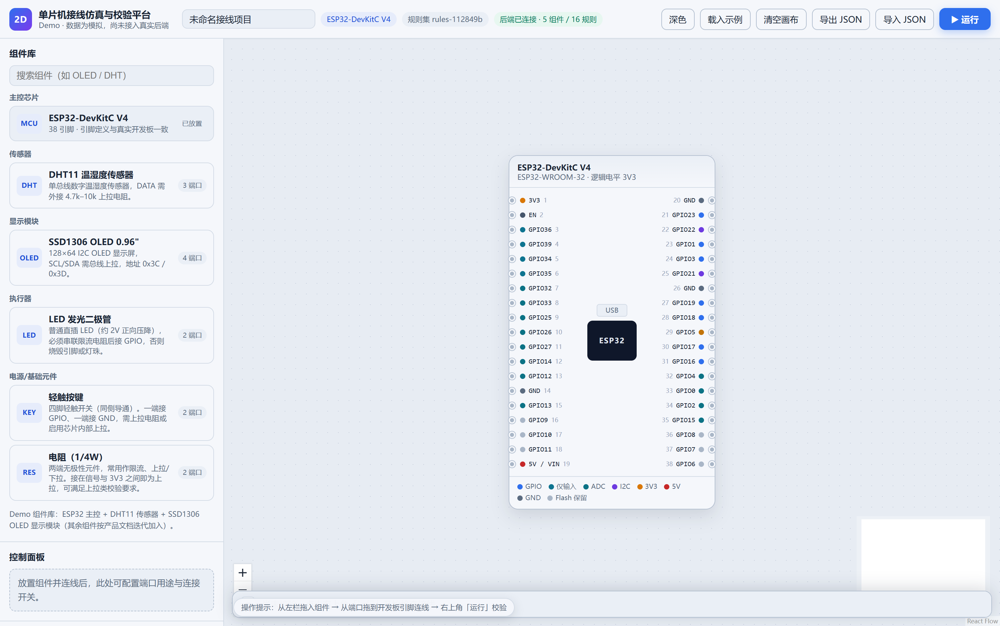
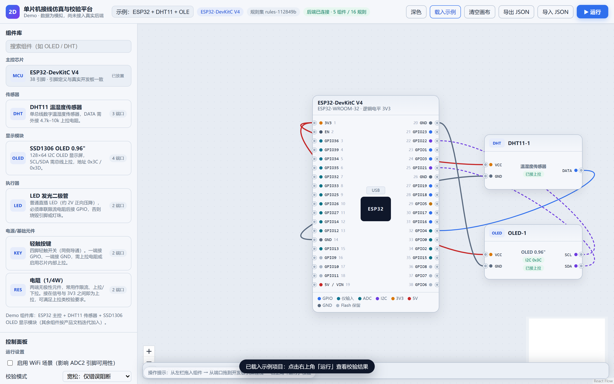
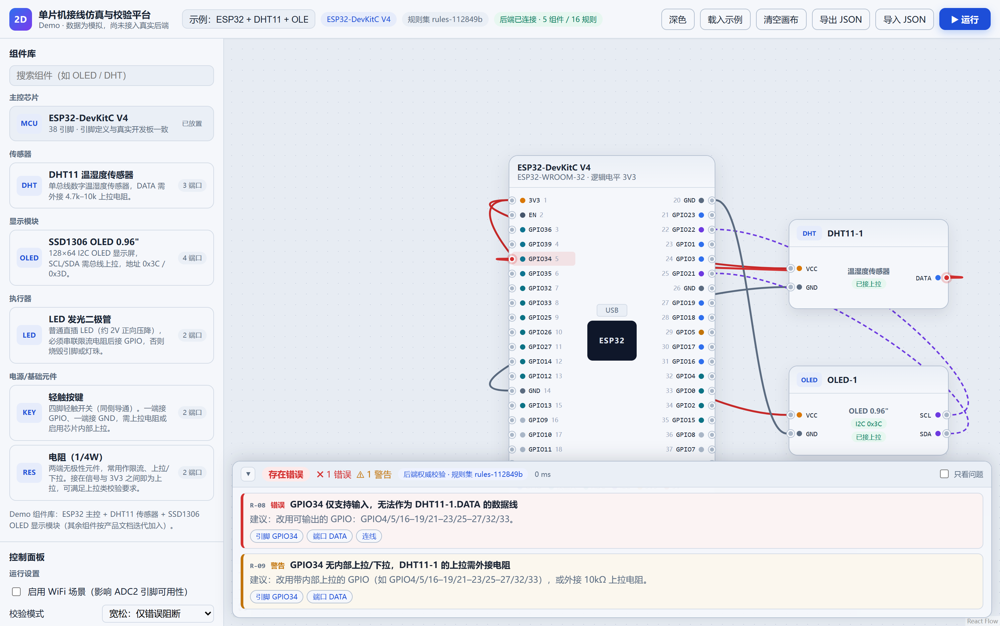
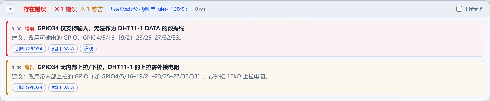
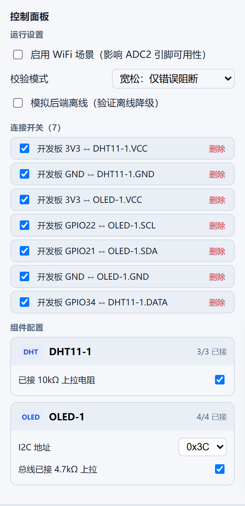
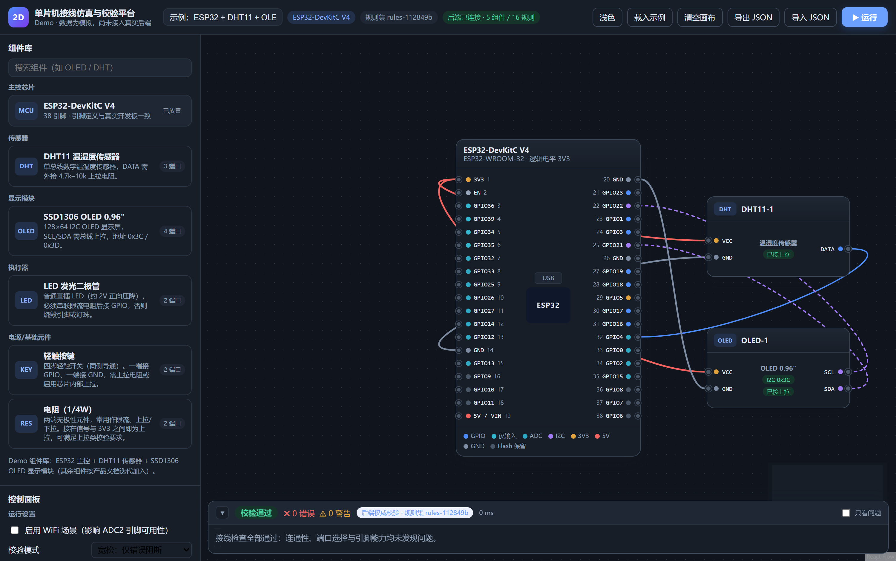

# MCU Wiring Simulator · 2D 单片机接线仿真与校验平台

在 2D 画布上摆放 ESP32 等主控与外设模块、拉线连接、一键校验接线是否正确。
**引脚定义与真实开发板一致**（ESP32-DevKitC V4，38 引脚），规则引擎前后端同源，支持离线运行。



## 为什么做这个

学生和初学者接线时最容易犯的错，往往代价最高：把输出接到仅输入引脚、5V 直接进 3.3V 逻辑、I2C 忘了上拉、电源与地短接。
本项目让你**在动手之前**把接线画出来并检查一遍——校验结论可定位到具体引脚，并给出修复建议。

## 核心能力

| 能力 | 说明 |
| --- | --- |
| 真实引脚模型 | ESP32-DevKitC V4 / WROOM-32：仅输入引脚（GPIO34–39）、Flash 保留（GPIO6–11）、ADC1/ADC2、Strapping、默认 I2C、UART0 占用等限制全部标注 |
| 画布接线 | 拖拽放置组件、端口到引脚连线、缩放平移、网格吸附、逐条连线禁用（做“如果不接这根线会怎样”的对比实验） |
| 撤销 / 重做 | 30 步历史，拖动等连续操作合并为一步；顶栏 ↶ ↷ 按钮 + 快捷键（`Ctrl/Cmd+Z`、`Ctrl/Cmd+Shift+Z`、`Ctrl+Y`） |
| 一键校验 | 20 条规则覆盖连通性、端口合法性、引脚能力、电源与共地、协议（I2C / 单总线 / UART 交叉）、电平匹配（5V→3.3V）、保护元件、大电流负载供电、负载需驱动模块 |
| 结果可定位 | 每条诊断含规则码、结论、修复建议；点击即在画布高亮对应引脚 / 组件 / 连线 |
| 规则说明（为什么） | 鼠标悬停任一条诊断，面板顶部即显示该规则的**原理**与**正确做法**（文案与规则实现同源，漏写会被单测拦下） |
| 组件库分类折叠 | 每个分类可点击收起/展开（状态本地记忆），搜索时自动展开命中分类 |
| 快捷键 | 撤销/重做、运行（`Ctrl+Enter`）、删除选中（`Backspace`/`Delete`）、`Esc` 取消选中、`F` 适配视图；顶栏「⌨ 快捷键」内有完整说明与操作技巧 |
| 双轨校验 | 本地规则引擎即时出结果（后端不可用也能用）+ 后端权威校验（规则集版本可追溯、可比对） |
| 项目持久化 | 后端保存 / 打开 / 导入导出 JSON；乐观锁避免并发覆盖；匿名项目按 ownerKey 隔离 |

## 操作流程

1. 从左侧组件库**拖入**组件（或双击快速放置）
2. 从组件端口拖到开发板引脚完成**连线**
3. 在**控制面板**配置端口用途、勾选保护元件（限流/上拉电阻）、按需禁用某条连线
4. 点击右上角**「运行」**（或按 `Ctrl/Cmd + Enter`）
5. 在底部**结果面板**查看诊断，点击条目定位到画布

> 误操作随时按 `Ctrl/Cmd + Z` 撤销（拖动、删除、清空画布都可恢复，最多 30 步）。



## 界面细节

| 校验通过 | 发现错误 |
| --- | --- |
|  |  |
| 结论标注来源（后端权威校验）与规则集版本 | R-08：把 DHT11 的 DATA 接到仅输入引脚 GPIO34 |

**诊断详情**（规则码 + 结论 + 建议 + 可点击定位）：



**点击诊断后定位并高亮引脚**（GPIO34 被标红，错误连线同步变红）：


**控制面板**（运行设置、连接开关、组件端口配置）：



**明暗主题**（顶栏一键切换，偏好本地持久化；深色下校验结果同样可读）：



## 校验规则（20 条）

| 规则码 | 名称 | 严重度 |
| --- | --- | --- |
| R-01 | 必要端口未连接 | 错误 |
| R-03 | 引脚重复占用（多驱动，电源/地允许多器件共享） | 错误 |
| R-05 | 信号线接到电源/地 | 错误 |
| R-06 | 电源未接入有效来源 | 错误 |
| R-07 | 未共地 | 错误 |
| R-08 | 仅输入引脚被用作输出 | 错误 |
| R-09 | 仅输入引脚缺少内部上拉 | 警告 |
| R-10 | Flash 保留引脚被占用 | 错误 |
| R-11 | ADC2 引脚与 WiFi 冲突 | 警告 |
| R-12 | 上拉电阻缺失（可被真实电阻元件满足） | 警告 |
| R-13 | I2C 地址冲突 | 错误 |
| R-14 | 使用非默认 I2C 引脚 | 警告 |
| R-16 | 占用启动敏感（Strapping）引脚 | 警告 |
| R-17 | 占用 UART0 串口引脚 | 警告 |
| R-18 | 电源短路 | 错误 |
| R-15 | 大电流负载（舵机 / 超声波）需独立供电 | 警告 |
| R-19 | LED 缺少限流电阻（可被真实电阻元件满足） | 警告 |
| R-20 | 串口 TX/RX 未交叉（模块 TX 必须接板 RX） | 错误 |
| R-21 | 5V 信号直连 3.3V 引脚（需分压 / 电平转换） | 错误 |
| R-22 | 负载直连 GPIO（电机等必须经驱动模块） | 错误 |

## 架构

```
mcu-wiring-simulator/
├── packages/
│   ├── contracts/      领域类型 + Zod 契约（前后端唯一真相源）
│   ├── definitions/    开发板与组件声明式定义（新增组件只改这里，核心零改动）
│   └── rule-engine/    16 条规则（纯函数，前后端复用同一份实现）
├── apps/
│   ├── web/            React 18 + React Flow 12 + Zustand 5
│   └── api/            NestJS 10 + Prisma 5 + SQLite（生产可切 PostgreSQL）
└── docs/               产品计划文档 + 技术设计文档（含界面配图）
```

## 快速开始

```bash
npm install
npm run build:packages

# 后端（首次需初始化数据库）
npx prisma migrate dev -w @sim/api --skip-seed
npm run seed -w @sim/api          # 写入定义数据（幂等）
npm run dev -w @sim/api           # http://127.0.0.1:3000/api/v1

# 前端
npm run dev -w @sim/web           # http://127.0.0.1:5180
```

前端数据源可切换：`VITE_API_MODE=http`（默认，接后端）或 `mock`（完全离线演示）。

## 测试与门禁

| 层级 | 命令 | 现状 |
| --- | --- | --- |
| 规则引擎单测 | `npm test -w @sim/rule-engine` | 47 例（引脚真实性 + 20 条规则正反例 + 教学说明完整性 + 可复现性） |
| 后端集成测试 | `npm test -w @sim/api` | 15 例（含 409 乐观锁冲突、数据隔离、导入导出往返、项目列表） |
| 前端单测 | `npm test -w @sim/web` | 33 例（流程集成 + 引用稳定性 + 项目管理 + 撤销重做 + UI 冒烟） |
| 真实浏览器冒烟 | `npm run smoke`（前后端需已启动） | 31 项断言，0 控制台错误 |
| 主题可读性扫描 | `node apps/web/scripts/check-contrast.mjs dark\|light` | 低对比度文本 0 项 |
| 全量 | `npm test && npm run typecheck && npm run build` | 95 例通过 / 0 error |

## 文档

- [产品计划文档（PRD）](docs/产品计划文档.md) —— 需求与验收、引脚真实性基线、规则清单、迭代路线
- [技术设计文档（TDD）](docs/技术设计文档.md) —— 架构与规范、API 契约、Wave 实施计划、实现进展与踩坑记录

## 技术栈

React 18 · TypeScript 5 · Vite 5 · React Flow 12 · Zustand 5 · NestJS 10 · Prisma 5 · SQLite / PostgreSQL · Zod · Vitest · Playwright（复用系统 Chrome，不下载 Chromium）

## 已知限制

- 组件库当前 **1 块开发板 + 13 个组件**（ESP32-DevKitC V4、DHT11、HC-SR04 超声波、SSD1306 OLED、LCD1602、LED、轻触按键、有源蜂鸣器、无源蜂鸣器、SG90 舵机、直流电机、L298N 电机驱动、USB-TTL 串口模块、电阻），按新增组件 SOP 持续补齐
- 已知限制：画布连线模型为「组件端口 ↔ 开发板引脚」，**暂不支持"器件直连"**（如电机接驱动模块输出端、独立电源模块给外设供电、面包板内部导通）—— 这类元件需等待端口直连能力（见技术文档 Q-T2）
- 校验为**接线级**（连通性 / 端口 / 引脚能力），不含固件烧录、CPU 模拟与电气级精确仿真
- 前端项目管理面板尚未接后端（当前使用 localStorage 自动保存 + JSON 导入导出）
- 引脚数据由一致性单测保障，尚未与官方手册逐项人工核对（计划项）
