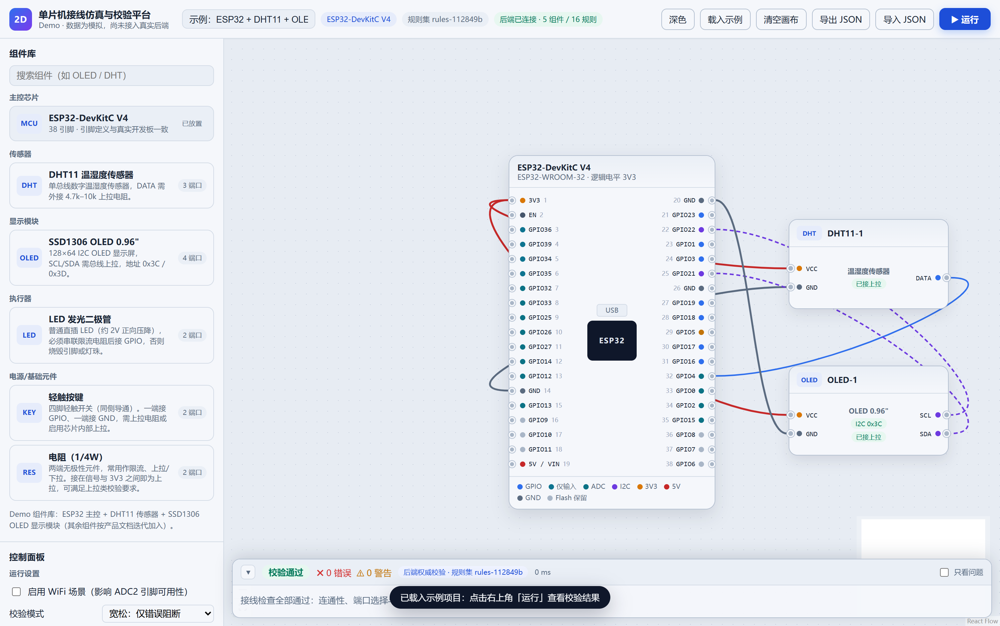
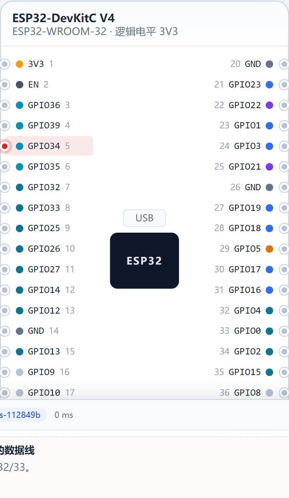

# 2D 可视化单片机接线仿真与测试平台 — 技术设计文档（TDD）

| 项目 | 内容 |
| --- | --- |
| 文档版本 | v0.1 |
| 日期 | 2026-09-13 |
| 文档状态 | 可执行（可直接按第 15 章 Wave 拆解开工） |
| 目标读者 | 前端开发、后端开发、测试、运维、以及接手的 AI Agent |
| 与 PRD 的关系 | `docs/产品计划文档.md` 定义**做什么**（需求、验收）；本文档定义**怎么做**（架构、规范、契约、迁移、实施顺序），并**以 Demo 实测结果修正 PRD 的推测部分** |
| 覆盖范围 | 现状基线、目标架构、目录规范、数据模型、定义层规范、规则引擎规范、前后端实现细则、API 契约、测试策略、工程规范、性能、安全、部署运维、Wave 实施计划、风险与未决项 |
| 可信度声明 | 本文中标注「实测」的结论来自真实运行验证；标注「待验证」的属设计推断，未经运行验证 |

---

## 0. 文档说明

### 0.1 与 PRD 的关系及修正原则

PRD 是"需求与初稿"，其中若干条目在当时属**推测**（例如 React Flow 能否表达"两列引脚开发板节点"、校验引擎前后端复用的可行性）。Demo 已完成并实测，因此本文档遵循以下修正原则：

1. **实测优先于推测**：凡 Demo 已验证的事实，本文档以此为准，并在第 1.4 章列出与 PRD 的偏差；
2. **不虚构成熟度**：Demo 未做的能力（真实后端、持久化、性能基准）在文中明确标注为「待实现」或「待验证」；
3. **规范替代自由发挥**：凡 Demo 中存在多种写法的地方，本文档给出唯一约定（如 Handle 编码、net 语义），后续新增代码必须遵循。

### 0.2 溯源标记约定

本文档对关键结论标注来源，便于核对与追责：

| 标记形式 | 含义 | 示例 |
| --- | --- | --- |
| `来源：文件:行` | Demo 中已存在的实现事实 | `来源：apps/web/src/rules/engine.ts:27` |
| `来源：PRD §X` | 来自产品计划文档的需求/决策 | `来源：PRD §9.3` |
| `来源：实测` | 本机真实运行/测试得到的结论 | 见 1.2 证据表 |
| `待验证` | 设计推断，尚未运行验证 | 例如后端 P95 指标 |
| `来源：官方文档` | 框架/依赖的官方说明 | 例如 React Flow 的 ConnectionMode |

### 0.3 当前仓库形态

```
2D 可视化单片机接线仿真与测试平台/          ← Git 仓库根（默认分支 master）
├── AGENTS.md                              ← 强制开发约定（每次改动必提交 + 必写测试）
├── docs/
│   ├── 产品计划文档.md                     ← PRD + 技术方案初稿（951 行）
│   └── 技术设计文档.md                     ← 本文档
├── apps/web/                              ← 已实现的前端 Demo（Vite + React + React Flow）
└── .ai-memory/                            ← 会话记忆（跨会话交接）
```

`来源：实测（git log：9ee5f5d → 97b3793 → f51149d → ef74d34 → a694637）`

---

## 1. 现状基线（Demo 实测）

### 1.1 代码结构现状

`来源：实测（行数统计命令，2026-09-13）`

| 文件 | 行数 | 职责 |
| --- | --- | --- |
| `src/rules/engine.ts` | 646 | 规则引擎：并查集 net 归并 + 14 条规则 + 稳定排序 + 模式判定 |
| `src/store/useProjectStore.ts` | 469 | 项目状态：画布/连线/校验/导入导出/示例项目；Handle 编解码 |
| `src/rules/__tests__/engine.test.ts` | 303 | 引擎单测（22 例：引脚真实性 + 规则正反例 + 稳定性） |
| `src/definitions/esp32.ts` | 177 | ESP32-DevKitC V4 完整 38 引脚定义 |
| `src/components/CanvasArea.tsx` | 176 | 画布：拖拽放置、连线、诊断高亮、缩放平移 |
| `src/components/InspectorPanel.tsx` | 159 | 控制面板：运行设置、连接开关、组件端口配置 |
| `src/components/ValidationPanel.tsx` | 146 | 结果面板：状态条 + 诊断列表 + 点击定位 |
| `src/definitions/types.ts` | 144 | 领域模型类型（契约的唯一真相源） |
| `src/components/nodes/BoardNode.tsx` | 133 | 开发板节点：两列引脚 + 能力着色 + 诊断高亮 |
| `src/store/__tests__/projectStore.test.ts` | 123 | store 集成测试（8 例：端到端/离线/约束/往返） |
| `scripts/smoke.mjs` | 97 | 真实浏览器 E2E 冒烟（10 项断言 + 截图） |
| `src/components/LibraryPanel.tsx` | 89 | 组件库：分类、搜索、拖拽放置 |
| `src/definitions/components.ts` | 86 | 组件定义：DHT11、SSD1306 OLED |
| `src/components/nodes/ComponentNode.tsx` | 81 | 组件节点：端口 Handle + 角色着色 |
| `src/components/TopBar.tsx` | 75 | 顶栏：项目名、导入导出、运行按钮 |
| `src/api/mockApi.ts` | 65 | Mock API（契约与 REST 草案一致，可替换为真实后端） |
| `src/store/__tests__/activeResult.test.tsx` | 63 | 引用稳定性回归测试（3 例，防白屏复发） |
| `src/__tests__/App.test.tsx` | 57 | UI 冒烟（4 例，DOM 级） |
| `src/store/useDiagnostics.ts` | 46 | 诊断索引（按目标聚合严重度，供高亮与定位） |
| `src/test/domPolyfills.ts` | 40 | jsdom polyfill（ResizeObserver / DOMMatrixReadOnly） |
| `src/App.tsx` | 31 | 应用根（布局 + Toast） |
| `src/main.tsx` | 12 | 入口 |
| （另有 `src/styles.css`） | — | 全部样式（设计令牌 + 节点/连线/面板样式） |

**合计：22 个 TS/TSX/MJS 源文件，3218 行；另有 1 个样式文件、4 个配置文件。**

### 1.2 已通过验证的能力与证据

| 能力 | 验证方式 | 结果 | 证据来源 |
| --- | --- | --- | --- |
| 38 引脚开发板节点渲染（两列真实排布 + 能力着色） | 真实 Chrome（headless） | 通过 | `scripts/smoke.mjs` 断言 `.pin-row` 计数 = 38 |
| 示例项目生成 7 条连线 | 真实 Chrome | 通过 | 同上，断言 `.react-flow__edge` = 7 |
| 点击「运行」→ 校验通过且不白屏 | 真实 Chrome | 通过 | 同上（回归断言） |
| 错误接线诊断（DATA→GPIO34） | 真实 Chrome | 通过 | 断言诊断含 `R-08` 与「建议」 |
| 点击诊断 → 引脚红色高亮定位 | 真实 Chrome | 通过 | 截图 `.smoke/05-locate.png`（高亮引脚数 1） |
| 后端离线降级标注 | 真实 Chrome | 通过 | 断言含「离线模式」 |
| 控制台零错误 / 零 4xx-5xx | 真实 Chrome | 通过 | `consoleErrors: []` |
| 引脚真实性（仅输入 / Flash 保留 / ADC / Strapping / 序号连续） | Vitest 单测 | 22 例通过 | `src/rules/__tests__/engine.test.ts` |
| 端到端流程（示例 / 离线 / 约束 / 导入导出往返 / 级联删除） | Vitest + jsdom | 8 例通过 | `src/store/__tests__/projectStore.test.ts` |
| selector 引用稳定性（白屏根因回归） | Vitest + jsdom | 3 例通过 | `src/store/__tests__/activeResult.test.tsx` |
| 类型检查 / 生产构建 | `tsc --noEmit` / `vite build` | 0 error / 构建成功（gzip 121 KB） | 实测（2026-09-13） |

**界面实证**（真实浏览器截图，结论标注来源与规则集版本）：



**门禁现状**：当前进度与证据见 §18.5（随每次 Wave 更新）。

### 1.3 已验证的技术决策（含踩坑记录）

> 本章是本文档最有价值的部分：以下每条都经实测，后续开发**必须沿用**，避免重走弯路。

| 编号 | 决策 | 依据 | 后续约束 |
| --- | --- | --- | --- |
| D-01 | 画布用 **React Flow**，端口即 `Handle` | 实测可表达"开发板两列引脚 + 引脚能力色" | 不得迁移到 Konva/Fabric（除非面包板插孔级需求确认，见 PRD A-08） |
| D-02 | 端口连线采用 **`ConnectionMode.Loose` + 单 Handle** | `ConnectionMode.Loose` 允许同一 Handle 双向连接，避免每个端口放两个重叠 Handle | 新增节点类型必须沿用 `Loose` 模式；`isValidConnection` 只做自环拦截 |
| D-03 | Handle id 编码为 `pin:<pinId>` / `port:<instanceId>:<portId>` | `来源：apps/web/src/store/useProjectStore.ts:27-38` | 编码格式是**跨模块契约**（画布、引擎、导入导出），变更须同步迁移函数 |
| D-04 | 规则引擎为**纯函数**，定义表由调用方注入 | `来源：apps/web/src/rules/engine.ts:669`（`validateProject` 接收 `defs`） | 引擎禁止 import DB/网络/定义数据；前后端复用同一份实现 |
| D-05 | net 归并用**并查集**，端点 key 为 `pin:x` / `port:a:b` | `来源：apps/web/src/rules/engine.ts:42,63` | 规则一律基于 net 判定，禁止自行遍历连线做重复归并 |
| D-06 | **电源/地引脚允许多器件共享**，仅 GPIO 类引脚校验多驱动 | `来源：apps/web/src/rules/engine.ts`（R-03 中 `pin.kind !== 'io'` 直接跳过） | 这是"电源轨语义"，新增规则不得把电源/地计入引脚占用 |
| D-07 | **连线仅允许「组件端口 ↔ 开发板引脚」** | `来源：apps/web/src/store/useProjectStore.ts`（`addConnection` 中 `from.type === to.type` 拒绝） | 若产品确认需要"器件并联"直连，须先扩展引擎的端点解析与 net 语义，不可只放开前端限制 |
| D-08 | 校验结果双轨：**本地即时结果 + 后端权威结果**；后者到达后覆盖 | `来源：apps/web/src/store/useProjectStore.ts`（`runValidation`） | UI 必须始终显示结果来源与规则集版本（离线时提示"可能过期"） |
| D-09 | ⚠️ **禁止在 zustand selector 内构造新对象/数组** | 实测缺陷：`{...localResult, offline:true}` 导致 `useSyncExternalStore` 无限渲染 → 白屏（提交 `ef74d34`） | derived 对象一律在 hook 内用 `useMemo` 缓存；新增 selector 必须过"引用稳定性"评审 |
| D-10 | 组件约束**声明式化**（`requirements[]` + `portOptions[].satisfies`） | `来源：apps/web/src/definitions/components.ts`（DHT11/OLED 定义） | 禁止为单个组件写专属规则分支；新约束先考虑能否进 `requirements` |
| D-11 | 校验必须**可复现**：同一输入 → 诊断集合与顺序完全一致 | 单测「同输入重复校验，诊断集合与顺序完全一致」 | 排序键固定为 `severity → code → 首个 target.id`；新增规则不得引入随机性 |
| D-12 | Demo 采用 **Mock API 替代后端**，但接口签名与 REST 草案一致 | `来源：apps/web/src/api/mockApi.ts` | 接真实后端时只替换该文件实现，UI 与引擎不改动 |
| D-13 | 真实浏览器验证用 **playwright-core + 系统 Chrome**（不下载 Chromium） | `来源：apps/web/scripts/smoke.mjs`（`channel: 'chrome'`） | 新增 UI 能力须同步扩展冒烟脚本断言；`.smoke/` 截图不入库 |

### 1.4 与 PRD 的偏差与 GAP 清单

#### 1.4.1 偏差（Demo 与 PRD 不一致，需按此修正认知）

| 编号 | PRD 描述 | Demo 实际 | 处理建议 |
| --- | --- | --- | --- |
| G-01 | 校验规则 20 条（R-01~R-20） | 实现 14 条；R-02/04/09/15/19/20 未实现（依赖 LED、舵机、电机、串口模块等尚未引入的组件类型） | 随组件引入分批补齐，见第 6.5 章状态矩阵 |
| G-02 | 组件库 17 类（PRD §7.2） | 仅 2 类（DHT11、SSD1306） | 按第 15 章 Wave 3/Wave 6 批量补齐，定义层已支持零改码新增 |
| G-03 | 前后端分离（NestJS + Prisma + DB） | 仅前端 + Mock API，无持久化（localStorage 代替） | Wave 1/Wave 4 落地后端，见第 8 章 |
| G-04 | 项目保存/导入导出（AC-07 往返一致） | 已实现 localStorage 自动持久化 + JSON 导入导出，往返一致性有单测 | Wave 4 换成服务端存储，迁移函数复用现有 JSON 结构 |
| G-05 | 面包板为"端口集合 + 内部导通分组" | 未实现 | 若保留该需求，需扩展 net 语义（内部导通 = 隐式连线），见第 4.4 章 |
| G-06 | 引脚数据需与官方手册逐项复核（UV-04） | 一致性单测覆盖关键事实，但**未与官方手册逐行人工核对** | Wave 2 出口标准之一：自查页导出 CSV + 人工核对留证 |
| G-07 | 性能指标（帧率 ≥50 FPS、`/validate` P95 <300ms） | **未测** | Wave 5 出口标准，见第 12 章 |

#### 1.4.2 必须补齐的能力（按优先级）

| 优先级 | GAP | 说明 |
| --- | --- | --- |
| P0 | 真实后端 + 持久化 | 当前刷新浏览器仅靠 localStorage；多设备/共享不可用 |
| P0 | 契约共享包 | 目前类型在 `apps/web/src/definitions/types.ts`，后端接入后必须上提为 `packages/contracts` |
| P0 | 规则集版本管理 | 目前版本号硬编码在 `engine.ts`，需改为内容哈希 + 服务端可配置启停 |
| P1 | 剩余 6 条规则 + 组件补齐 | 见 G-01/G-02 |
| P1 | 性能基准 | 见 G-07 |
| P1 | 引脚数据人工复核 | 见 G-06 |
| P2 | 撤销/重做、快捷键全集 | PRD FR-15 标 P1，Demo 未实现 |
| P2 | i18n、暗色主题 | PRD NFR-09 |

---

## 2. 目标架构

### 2.1 运行时拓扑

```
┌──────────────────────────────┐         ┌───────────────────────────────┐
│  浏览器（SPA）                │  HTTPS  │  应用服务（容器）              │
│  apps/web                    │ ──────► │  apps/api (NestJS)            │
│  ├─ React Flow 画布           │ /api/v1 │  ├─ board / component 定义读取 │
│  ├─ Zustand 画布状态          │         │  ├─ project CRUD              │
│  ├─ packages/rule-engine      │         │  ├─ validation 编排            │
│  │  （本地即时校验，离线可用）  │         │  └─ rule_set 配置              │
│  └─ packages/contracts 类型    │         └───────────┬───────────────────┘
└──────────────────────────────┘                     │ Prisma
                                                     ▼
                                        ┌───────────────────────────────┐
                                        │ PostgreSQL（生产）             │
                                        │ SQLite（本地开发，同 schema）  │
                                        └───────────────────────────────┘
共享包：packages/contracts（Zod schema + 类型）、packages/rule-engine（纯函数规则）、
        packages/definitions（开发板与组件声明式数据）
```

**关键不变式**（来源：PRD §10.6 + 实测 D-04/D-12）

1. 依赖方向单向：`apps/* → packages/*`，`packages/contracts` 是叶子（无业务依赖）；
2. `packages/rule-engine` 不依赖 DB / 网络 / React（保证前后端复用）；
3. `apps/web` 与 `apps/api` **不互相 import**，只经 HTTP + contracts 通信；
4. Demo 中的 `src/definitions/types.ts` 上提为 `packages/contracts`，`src/definitions/esp32.ts|components.ts` 上提为 `packages/definitions`。

### 2.2 Monorepo 目标目录结构与迁移映射

```
/
├── AGENTS.md
├── package.json                    # pnpm workspace 根（新增）
├── pnpm-workspace.yaml             # 新增
├── docs/
├── apps/
│   ├── web/                        # 现有 Demo（原地演进，不重写）
│   │   ├── scripts/smoke.mjs
│   │   └── src/
│   │       ├── components/         # 画布与面板（保持）
│   │       ├── store/              # 项目状态（保持）
│   │       ├── api/                # ← 改为 httpClient 实现（替换 mockApi 内部）
│   │       └── styles.css
│   └── api/                        # 新增：NestJS
│       ├── src/
│       │   ├── main.ts
│       │   ├── modules/{board,component,project,validation,health}/
│       │   ├── common/{filters,interceptors,guards}/
│       │   └── prisma/{schema.prisma,seed.ts,migrations/}
│       └── test/
└── packages/
    ├── contracts/                  # 新增：Zod schema（来源：web/src/definitions/types.ts）
    ├── definitions/                # 新增：boards/ + components/（来源：web/src/definitions/*.ts）
    └── rule-engine/                # 新增：rules/（来源：web/src/rules/engine.ts）
```

**迁移映射表**（Wave 1 执行，纯移动 + 改 import，不改逻辑）

| 现状文件 | 目标位置 | 处理方式 |
| --- | --- | --- |
| `apps/web/src/definitions/types.ts` | `packages/contracts/src/types.ts` | 移动 + 追加 Zod schema；web 改为 `import type { ... } from '@sim/contracts'` |
| `apps/web/src/definitions/esp32.ts` | `packages/definitions/src/boards/esp32.ts` | 移动；`getBoard` 保留 |
| `apps/web/src/definitions/components.ts` | `packages/definitions/src/components/*.ts` | 拆分为每组件一文件 + `index.ts` 汇总 |
| `apps/web/src/rules/engine.ts` | `packages/rule-engine/src/{engine,nets,rules/*}.ts` | 拆分单文件为 `rules/` 目录（每规则一文件，见 6.2）；`RULES` 改为自动收集 |
| `apps/web/src/rules/__tests__/engine.test.ts` | `packages/rule-engine/test/` | 移动；新增每规则的独立测试文件 |
| `apps/web/src/api/mockApi.ts` | `apps/web/src/api/{mockApi,httpClient}.ts` | 保留 mock 实现（供离线/测试），新增真实实现；由 `VITE_API_MODE` 切换 |

### 2.3 模块依赖规则与强制手段

| 规则 | 强制手段 |
| --- | --- |
| `packages/*` 之间只允许 `contracts` 被依赖；`rule-engine` 只依赖 `contracts` | ESLint `import/no-restricted-paths` |
| `apps/web` 不得直接 import `apps/api` | 同上 |
| `apps/web` 不得重写规则逻辑（必须用 `@sim/rule-engine`） | ESLint 禁止在 `apps/web/src` 下出现 `Diagnostic[]` 返回签名的新模块；Code Review 检查清单 |
| 契约类型只能在 `packages/contracts` 定义 | CI 检查：`apps/**` 中禁止定义同名接口（脚本 grep） |
| 定义数据只能放 `packages/definitions` | 同上 |

### 2.4 环境与部署拓扑

| 环境 | 前端 | 后端 | 数据库 | 用途 |
| --- | --- | --- | --- | --- |
| local | `vite dev`（5180） | `nest start --watch`（3000） | SQLite 文件 | 日常开发；可用 mock 模式完全脱离后端 |
| ci | `vite build` 产物 | `npm run build` | 临时 PostgreSQL（容器） | 跑单测/集成/E2E/冒烟 |
| staging | 静态托管（版本目录） | 容器（tag=commit SHA） | PostgreSQL | 发布前验收、冒烟 |
| prod | 静态托管 + CDN | 容器滚动更新（10%→50%→100%） | PostgreSQL（备份 + PITR） | 生产；发布走渐进式，回滚 < 5 min |

---

## 3. 技术栈与版本基线

### 3.1 最终版本基线

| 层级 | 技术 | Demo 实际版本（锁定） | 目标版本 | 备注 |
| --- | --- | --- | --- | --- |
| 运行时 | Node.js | v24.18.0（实测） | ≥ 20 LTS | CI 与本地保持一致大版本 |
| 包管理 | npm（Demo）→ pnpm workspace | npm 11.16.0 | pnpm 9+ | 引入 monorepo 时切换；lockfile 必须入库 |
| 前端框架 | React | 18.3.1 | 18.x（不升 19，避免 React Flow 兼容风险，`待验证`） | — |
| 构建 | Vite | 5.4.21（实测） | 5.x | — |
| 画布 | @xyflow/react | 12.3.5+ | 12.x（精确锁版本） | 升级前必须跑 `npm run smoke` |
| 状态 | Zustand | 5.0.2+ | 5.x | 遵守 D-09 |
| 后端 | NestJS | 未实现 | 10.x | — |
| ORM | Prisma | 未实现 | 5.x | SQLite ↔ PostgreSQL 双 provider |
| 数据库 | SQLite（本地）/ PostgreSQL（生产） | — | PG 15+ | 差异见 4.4 |
| 契约 | Zod | 未实现 | 3.x | `nestjs-zod` 生成 OpenAPI |
| 测试 | Vitest / jsdom / @testing-library/react | 2.1.9 / 26.x / 16.x（实测） | 同左 | — |
| E2E | playwright-core + 系统 Chrome | 1.63.0+（实测） | 同左 | 不下载 Chromium |
| 语言 | TypeScript | 5.6.3+（`strict: true`） | 5.x | `noUnusedLocals`/`noUnusedParameters` 已开启 |

### 3.2 版本与升级策略

1. **精确锁版本**：`package.json` 中 React Flow、Zustand、Prisma 使用精确版本（不用 `^`），避免画布行为被小版本改动破坏；
2. **升级门禁**：任何依赖升级必须 ① 通过全量单测 ② 通过 `npm run smoke` ③ 附升级原因与回滚方式；
3. **lockfile 必入库**：CI 使用 `npm ci`（或 `pnpm install --frozen-lockfile`）拒绝未锁定的安装。

### 3.3 依赖引入审查门禁（供应链）

`来源：PRD §15.1 + 技能威胁建模要求`

| 检查项 | 要求 |
| --- | --- |
| 必要性 | 能在不引入依赖的前提下用 50 行内代码实现 → 不引入 |
| 维护度 | 最近 12 个月有提交；非个人废弃仓库 |
| 许可 | MIT / Apache-2.0 / BSD；GPL 系需产品确认 |
| 漏洞 | `npm audit --audit-level=high` 无 high/critical |
| 体积 | 前端依赖需评估 gzip 体积增量（> 30 KB 需说明理由） |
| 记录 | 在 PR 描述中列出：包名、版本、用途、审查结论 |

---

## 4. 领域模型与数据结构

> 本文档只定义**类型契约与表结构**，不提供业务实现代码。所有类型签名以现有 Demo 为准上提（`来源：apps/web/src/definitions/types.ts`）。

### 4.1 类型即契约（`packages/contracts`）

核心类型（现状已实现，直接上提）：

```ts
// 端点引用：连线的两端（跨模块契约，编码见 D-03）
type EndpointRef =
  | { type: 'pin'; pinId: string }
  | { type: 'port'; instanceId: string; portId: string };

interface Connection {
  id: string;
  from: EndpointRef;
  to: EndpointRef;
  kind: 'signal' | 'power' | 'ground' | 'bus';
  enabled: boolean;            // 禁用者不参与校验（控制面板开关）
}

interface Diagnostic {
  code: string;                // 规则码，如 'R-08'
  severity: 'error' | 'warning' | 'info';
  message: string;
  suggestion?: string;
  targets: DiagnosticTarget[]; // 用于画布定位与高亮
}

interface ValidationResult {
  status: 'passed' | 'warning' | 'failed';
  ruleSetVersion: string;      // 可复现关键：记录规则集版本
  diagnostics: Diagnostic[];
  durationMs: number;
  source: 'local' | 'server';
  offline?: boolean;           // 本地结果标注，提示规则集可能过期
}
```

**上提时的新增内容**（后端接入需要）：

| 新增 | 说明 |
| --- | --- |
| Zod schema（与上述类型一一对应） | 用于请求体校验（后端）与响应校验（前端运行时防线） |
| `CreateProjectRequest` / `PatchProjectRequest` / `ValidateRequest` | API 入参契约 |
| `ApiEnvelope<T>` / `ApiError` | 统一响应包络（见 9.1） |

### 4.2 数据库 Schema（Prisma）

`来源：PRD §11.2（表结构草案）+ Demo 数据结构实测`

| 模型 | 关键字段 | 索引/约束 | 说明 |
| --- | --- | --- | --- |
| `BoardDefinition` | `slug` `version` `displayName` `mcuFamily` `logicVoltage` `pins Json` `sourceRef Json` | `@@unique([slug, version])` | 引脚为 JSON（半结构化，读多写少） |
| `ComponentDefinition` | `slug` `version` `displayName` `category` `ports Json` `protocols String[]` `requirements String[]` `portOptions Json` `iconKey` `enabled` | `@@unique([slug, version])`、`@@index([category, enabled])` | 与 `packages/definitions` seed 同步（幂等） |
| `Project` | `id` `name` `ownerKey` `boardSlug` `boardVersion` `schemaVersion` `revision Int` `viewport Json` `expiresAt` | `@@index([ownerKey])`、`@@index([expiresAt])` | `ownerKey` = 匿名浏览器 UUID（Demo 用 localStorage 的替代实现） |
| `ComponentInstance` | `id` `projectId` `definitionSlug` `definitionVersion` `label` `x` `y` `portConfig Json` | `@@index([projectId])` | 与项目分离存储，支持增量 PATCH |
| `Connection` | `id` `projectId` `fromType` `fromRef Json` `toType` `toRef Json` `kind` `enabled` | `@@index([projectId])` | `fromRef` = `{pinId}` 或 `{instanceId, portId}` |
| `RuleSet` | `version` `configSnapshot Json` `createdAt` | `@id` = version | `version` = 规则码+参数+severity 的内容哈希 |
| `RuleConfig` | `code` `enabled` `severityOverride` `params Json` | `@id` = code | 后台可调启停与严重度，规则实现不变 |
| `ValidationRun` | `id` `projectId` `projectRevision` `ruleSetVersion` `status` `diagnostics Json` `durationMs` | `@@index([projectId, createdAt])` | 只保留最近 20 条/项目（定时清理） |

**事务边界**：一次"保存项目" = 1 个事务（更新 `Project.revision` + 全量替换 `ComponentInstance`/`Connection`）。`ValidationRun` 写入独立事务（失败不影响保存）。

### 4.3 三套版本号与可复现策略

| 版本号 | 载体 | 何时递增 | 作用 |
| --- | --- | --- | --- |
| `schemaVersion`（项目数据格式） | `Project.schemaVersion` | 项目 JSON 结构变更 | 打开老项目时执行迁移函数（纯函数 + 单测） |
| `definitionVersion`（板/组件） | 定义记录 | 引脚/端口/需求变更 | 项目记录所用版本，保证历史项目结论不变 |
| `ruleSetVersion`（规则集） | `RuleSet.version` | 规则码集合或参数变化 | 校验结果可复现、可比对（对应单测「同输入同输出」） |

**迁移实现约定**：`packages/contracts/src/migrations/` 下每个版本一个纯函数 `(payload) => payload`，附带单测；`importJson` 时按 `schemaVersion` 链式迁移，失败返回 `SCHEMA_MIGRATION_FAILED`。

### 4.4 SQLite ↔ PostgreSQL 差异清单（必须遵守）

| 差异点 | 约定 |
| --- | --- |
| 枚举 | 不使用 DB 原生 enum，用 `String` + 应用层 Zod 校验（Prisma 在 SQLite 无 enum） |
| 数组 | `protocols` / `requirements` 用 JSON 存储（不用 PG 原生数组），避免 provider 差异 |
| JSON 查询 | 禁止使用 PG 特有 JSON 操作符；过滤在应用层完成（数据量小） |
| 大小写敏感 | 统一用 `slug` 小写 + `@unique`，不依赖 DB 排序规则 |
| 并发写 | SQLite 无并发写；本地开发串行保存即可，生产用 PG（乐观锁 revision） |
| CI | 集成测试必须在 PostgreSQL 下跑一遍（Docker），保证 provider 切换不回归 |

**面包板语义扩展（如保留 G-05 需求）**：面包板定义为"虚拟连通组"，其内部导通表达为**隐式连线**（在 `buildNets` 之前注入 `kind='bus'` 的合成 Connection），而非新增端点类型——这样不破坏现有规则与 net 归并（`待验证`：需评估合成连线对 `targets` 定位的影响）。

---

## 5. 定义层规范（开发板 / 组件）

### 5.1 开发板定义规范

必填字段：`slug` `version` `displayName` `mcuFamily` `logicVoltage` `sourceRef` `pins[]`。
引脚必填：`id` `physicalLabel` `number` `side` `order` `kind` `capabilities[]` `voltageDomain`。
引脚可选：`internalPull` `note`。

**`validate-board` 脚本校验规则**（CI 阻断级）：

| 编号 | 规则 |
| --- | --- |
| B-01 | `id` 全局唯一，格式 `pin-<boardSlug>-<label>` |
| B-02 | `number` 连续且从 1 开始（38 脚板必须是 1..38） |
| B-03 | `side` 仅 `left`/`right`，同侧 `order` 唯一且连续 |
| B-04 | `inputOnly` 引脚不得声明 `PWM`/`OUTPUT` 能力 |
| B-05 | `FLASH_RESERVED` 引脚必须声明 `note` |
| B-06 | `kind='power'` 必须带 `voltageDomain`；`kind='ground'` 必须是 `GND` |
| B-07 | `sourceRef` 必填（数据可追溯，对应 PRD §8.3） |

### 5.2 组件定义规范

```ts
interface ComponentDef {
  slug: string; displayName: string; category: ComponentCategory;
  icon: string;                       // 短标识（Demo 用字符，后续换 SVG key）
  version: string;                    // semver
  description: string;
  ports: PortDef[];                   // role: signal|power|ground；required 标记必要连接
  protocols: string[];                // ['I2C'] / ['OneWire'] / []
  requirements: RequirementKind[];    // ['i2c-pullup'] 声明式约束（D-10）
  portOptions?: PortOptionDef[];      // 运行时可配置项，satisfies 关联 requirements
}
```

**强制约定**：

1. 端口 `direction` 的语义是**"主控如何驱动该线"**：I2C 的 SCL 记为 `out`（时钟由主机输出），SDA 为 `io` —— 这样接到仅输入引脚才会正确触发 `R-08`（`来源：apps/web/src/definitions/components.ts` 中的注释）；
2. `requirements` 只允许声明**通用约束类型**；新增约束类型必须同时新增一条读取该类型的通用规则，禁止在规则里判断 `slug`；
3. `version` 在端口/需求变更时递增，并同步 `packages/definitions/CHANGELOG`。

### 5.3 新增开发板 SOP

```
① 新建 packages/definitions/src/boards/<slug>.ts（照 esp32.ts 结构）
② 运行 pnpm validate:board <slug> → 通过 B-01..B-07
③ 补一致性单测（关键能力断言，模板见 5.5）
④ 执行 seed（幂等）：写入 BoardDefinition（slug+version 唯一）
⑤ 前端零改码即可选择该板（板选择器读 GET /api/v1/boards）
⑥ 出口验收：能被选中、38/64 引脚渲染正确、可连线、校验可跑
```

### 5.4 新增组件 SOP

```
① 复制 components/dht11.ts → 新组件文件，改 slug/端口/属性/requirements/portOptions
② 若引入新约束类型 → 同步新增通用规则 + 规则测试（见 6.6）
③ 补定义单测（端口数、required 标记、requirements 与 portOptions.satisfies 对应）
④ seed 幂等同步 → 前端组件库自动出现（按 category 分组）
⑤ 出口验收：拖入画布、端口可连线、能触发相应规则（正例 + 反例各一条）
⑥ 若引入新分类 → 同时改：Category 枚举 + 菜单分组 + 图标映射（三处，对应 PRD E-06）
```

### 5.5 引脚真实性保障（一致性单测模板）

现有测试已覆盖的关键事实（`来源：apps/web/src/rules/__tests__/engine.test.ts`）：

| 断言 | 内容 |
| --- | --- |
| 仅输入引脚 | GPIO34/35/36/39 含 `INPUT_ONLY`，不含 `GPIO` |
| Flash 保留 | GPIO6–11 含 `FLASH_RESERVED` |
| ADC 分组 | ADC1 = {32,33,34,35,36,39}；ADC2 = {0,2,4,12,13,14,15,25,26,27} |
| 默认 I2C | SDA=GPIO21、SCL=GPIO22 |
| Strapping | {0,2,5,12,15} |
| 结构 | `id` 唯一；`number` 连续 1..38 |

**新增板型必须复制这套断言**（数值替换），并在 Wave 2 出口完成"自查页导出 CSV ↔ 官方手册"人工核对留证（对应 G-06 / PRD UV-04）。

---

## 6. 规则引擎实现规范

### 6.1 引擎接口（现状即目标）

`来源：apps/web/src/rules/engine.ts:669`

```ts
interface ValidateArgs {
  board: BoardDef;
  instances: ComponentInstance[];
  connections: Connection[];      // 含 enabled 标记
  defs: ComponentDef[];           // 由调用方注入（D-04）
  options?: { wifiEnabled?: boolean; mode?: 'strict' | 'loose' };
}
declare function validateProject(args: ValidateArgs): ValidationResult;
```

**执行流水线（固定顺序，不得调整）**：

```
[1] 结构校验（id 唯一、引用存在）
[2] net 归并（并查集）
[3] 板级能力校验（R-08/R-10/R-11/R-16/R-17）
[4] 电气域简化校验（R-05/R-06/R-07/R-18）
[5] 协议校验（R-13/R-14）
[6] 组件声明式需求校验（R-01/R-12）
[7] 汇总 + 稳定排序（severity → code → target.id）
```

> 说明：现阶段 [1] 由前端序列化时保证，[3]~[6] 已在 `RULES` 数组中按顺序执行（规则之间无状态依赖，顺序仅影响可读性）。

### 6.2 规则编写模板（新增规则唯一允许的写法）

```
packages/rule-engine/src/rules/r08-input-only.ts
├── export const meta = { code: 'R-08', name: '仅输入引脚被用作输出', severity: 'error',
│                          scope: 'connection', tags: ['pin-capability'] }
├── export const run = (input: RuleInput): Diagnostic[] => { ... }
└── 测试：packages/rule-engine/test/r08.test.ts（正例 1 + 反例 1 + 边界 1）
```

**硬性要求**：

1. 规则必须是纯函数：**禁止** `Date.now()`、随机数、`console`、网络、DOM；
2. 消息必须可读且包含具体对象名（如 `GPIO34 仅支持输入，无法作为 DHT11-1.DATA 的数据线`）；
3. 必须给 `suggestion`（教学价值，对应 PRD §9.3）；
4. `targets` 必须包含足以定位的元素（引脚 / 组件 / 端口 / 连线）；
5. 新增规则必须同时更新规则集版本（内容哈希自动变化）。

### 6.3 net 归并算法（禁止绕过）

`来源：apps/web/src/rules/engine.ts:42,63`

| 要素 | 约定 |
| --- | --- |
| 端点 key | `pin:<pinId>` / `port:<instanceId>:<portId>`（与 Handle 编码同源，D-03） |
| 归并 | 并查集（路径压缩）；仅归并 `enabled=true` 的连线 |
| 输出 | `Net { key, pins: PinDef[], ports: {instance, def, portId}[] }` |
| 共享语义 | 电源/地引脚可被多器件共享（D-06）；GPIO 类引脚多占用由 R-03 报错 |
| 禁用连线 | 等价于"断开"（校验输入中移除），因此可能触发 R-01/R-06/R-07 |

### 6.4 稳定性与可复现要求

1. 同输入 → 诊断集合与顺序完全一致（单测已覆盖）；
2. 诊断项去重语义：同一 (code, 首个 target) 组合不应重复出现；当前实现中 R-11/R-16/R-17 按**每条连线**产出，如需按引脚聚合，须调整并更新测试；
3. `ruleSetVersion` 由规则码 + severity + 参数哈希生成（后端实现时落地）；前端内置版本号与后端不一致时，UI 必须提示"规则集已更新"。

### 6.5 规则清单与实现状态矩阵

| 规则码 | 名称 | 严重度 | Demo 状态 | 依赖的组件类型 |
| --- | --- | --- | --- | --- |
| R-01 | 必要端口未连接 | error | ✅ 已实现 | — |
| R-02 | 悬空电源/地（net 无来源） | error | ⛔ 未实现（由 R-06/R-07 覆盖等价语义） | — |
| R-03 | 引脚重复占用（多驱动） | error | ✅ 已实现 | — |
| R-04 | 输出-输出冲突 | error | ⛔ 未实现（R-03 覆盖） | — |
| R-05 | 信号线接到电源/地 | error | ✅ 已实现 | — |
| R-06 | 电源未接入有效来源 | error | ✅ 已实现 | — |
| R-07 | 未共地 | error | ✅ 已实现 | — |
| R-08 | 仅输入引脚被用作输出 | error | ✅ 已实现 | — |
| R-09 | 仅输入引脚要求内部上拉 | warning | ⛔ 未实现 | — |
| R-10 | Flash 保留引脚被占用 | error | ✅ 已实现 | — |
| R-11 | ADC2 与 WiFi 冲突 | warning | ✅ 已实现（受 `wifiEnabled` 开关控制） | — |
| R-12 | 上拉电阻缺失 | warning | ✅ 已实现（读 `requirements` + `portOptions.satisfies`） | DHT11 / OLED |
| R-13 | I2C 地址冲突 | error | ✅ 已实现 | OLED（可加第二个实例复现） |
| R-14 | 使用非默认 I2C 引脚 | warning | ✅ 已实现 | OLED |
| R-15 | 大电流负载需独立供电 | warning | ✅ 已实现（读 `requirements: external-power`，可勾选豁免） | 舵机 / 超声波 |
| R-16 | 占用 Strapping 引脚 | warning | ✅ 已实现 | — |
| R-17 | 占用 UART0 引脚 | warning | ✅ 已实现 | — |
| R-18 | 电源短路 | error | ✅ 已实现 | — |
| R-19 | 限流/保护元件缺失 | warning | ⛔ 未实现 | LED / 感性负载 |
| R-20 | 串口 TX/RX 未交叉 | error | ✅ 已实现（依赖板引脚 `UART0_TX/RX`、`UART2_TX/RX` 角色标签） | USB-TTL 串口模块 |
| R-21 | 5V 信号直连 3.3V 引脚 | error | ✅ 已实现（可被 `signal-voltage-match` 声明豁免） | HC-SR04（ECHO 为 5V 输出） |

**统计：19 已实现 / 2 待实现**（R-02 悬空电源/地、R-04 输出-输出冲突 —— 语义已被 R-06/R-07/R-03 覆盖，建议合并而非新增）。

> 组件库同步扩展至 **1 块开发板 + 9 个组件**：DHT11、HC-SR04、SSD1306 OLED、LED、轻触按键、有源蜂鸣器、SG90 舵机、USB-TTL、电阻；新增 `communication`（通信模块）分类，按 E-06 同步了契约枚举、分组标签与组件定义三处。

### 6.6 新增规则 SOP

```
① 依据 6.2 模板新增规则文件（含 meta + run）
② 新增规则测试（正例/反例/边界各 ≥1）
③ 更新本文件 6.5 状态矩阵
④ 跑 packages/rule-engine 全量单测（确保既有规则无回归）
⑤ 规则集版本变化 → 前端提示"有新规则集"，老项目仍按记录版本复现
⑥ 出口验收：既有示例项目在宽松模式下仍 passed（新规则不得误报）
```

---

## 7. 前端实现方案

### 7.1 目录结构（现状 + 目标微调）

| 目录 | 现状 | 目标调整 |
| --- | --- | --- |
| `src/components/` | 4 个面板 + 2 个节点 | 拆为 `features/{canvas,library,inspector,validation}/`（Wave 6 可选重构） |
| `src/store/` | `useProjectStore`、`useDiagnostics` | 拆 `stores/{canvasStore,validationStore,uiStore}`；`useActiveResult` 保留 |
| `src/api/` | `mockApi.ts` | 新增 `httpClient.ts` + `client.ts`（按 `VITE_API_MODE` 选择实现） |
| `src/definitions/` | 板 + 组件 + 类型 | 类型与定义迁出到 packages，仅保留 re-export 门面 |

### 7.2 画布实现细则（必须沿用的既定约定）

| 主题 | 约定 | 来源 |
| --- | --- | --- |
| 连接模式 | `connectionMode={ConnectionMode.Loose}`，每端口一个 `Handle` | `CanvasArea.tsx:156`（D-02） |
| Handle 编码 | `pin:<pinId>` / `port:<instanceId>:<portId>`，编解码函数集中在 store | `useProjectStore.ts:27-38`（D-03） |
| 自环拦截 | `isValidConnection` 只拦 `source === target`；类型冲突由规则报错（教学需要"故意连错"） | `CanvasArea.tsx` |
| 节点渲染 | `nodeTypes` 定义在模块级常量（禁止在组件内创建，否则每次渲染重建节点） | `CanvasArea.tsx` |
| 拖拽放置 | HTML5 DnD：`dataTransfer.setData('application/sim-component', slug)` + `screenToFlowPosition` | `CanvasArea.tsx` |
| 网格吸附 | `snapToGrid` + `snapGrid={[8,8]}` | 同上 |
| 大项目性能 | 组件数 > 50 时启用 `onlyRenderVisibleElements`；规则引擎移入 Web Worker（`待验证`） | PRD §10.9 |
| 连线视觉 | 电源红 / 地灰 / 信号蓝 / I2C 紫虚线 / 禁用灰虚线 / 错误红加粗 | `styles.css` |

### 7.3 状态管理硬性规则（违反即白屏级事故）

1. **selector 只读单一字段或稳定引用**，禁止在 selector 内构造对象/数组（D-09，实测白屏根因）；
2. 派生对象（如"合并本地与后端结果"）必须在自定义 hook 内用 `useMemo` 缓存，并**为引用稳定性写回归测试**（`activeResult.test.tsx` 为模板）；
3. 服务端状态（定义、项目列表）用 TanStack Query 管理，不塞进 zustand；
4. 画布状态（instances/connections/selection）用 zustand + `persist`（Demo 已用 `persist` 中间件，key = `sim-mcu-project`）；
5. 任何新增派生数据（诊断索引、边样式计算结果）都必须 `useMemo`，且依赖数组不得包含每次渲染新建的值。

### 7.4 交互实现要点

| 功能 | 实现要点 | 现状 |
| --- | --- | --- |
| 组件放置 | 拖拽落点减去节点半宽高（`-70/-50`），避免指针偏离中心 | ✅ |
| 连线创建 | `onConnect` 解析两端 Handle → `addConnection`；重复连线/自环/同类型端点均被拒绝并 Toast 提示 | ✅ |
| 连接禁用 | 控制面板逐条开关；禁用后连线灰化且不参与校验 | ✅ |
| 端口配置 | 读 `portOptions` 动态渲染 select/toggle；`satisfies` 决定是否满足声明式需求 | ✅ |
| 撤销/重做 | **已实现**（FR-15）：订阅式记录（不逐个 action 插桩，新增编辑入口不会漏记）+ 事务合并拖动 + 30 步上限；`undo()/redo()` 为 store action，撤销后清空选中并置 `hasRun=false` | ✅ |
| 快捷键 | **已实现**：`Ctrl/Cmd+Z` 撤销、`Ctrl/Cmd+Shift+Z` / `Ctrl+Y` 重做、`Ctrl/Cmd+Enter` 运行、`Esc` 取消选中（`hooks/useHotkeys.ts`）；`F` 适配视图在画布内注册（需 React Flow 上下文）；输入框内不拦截 | ✅ |
| 导入导出 | JSON 往返一致性有单测（`projectStore.test.ts`）；导入前校验未知组件定义 | ✅ |
| 规则说明（为什么） | **已实现**：文案与规则同源（`packages/rule-engine/src/ruleDocs.ts`），结果面板内**固定高度**说明区，悬停/聚焦诊断头即显示「原理 + 正确做法」；单测强制每条规则必须有说明（防漏写） | ✅ |
| 组件库分类折叠 | **已实现**：`collapsedGroups` 持久化（收起后下次仍收起）；搜索时强制展开（避免"搜到却看不到"）；分类顺序由 `CATEGORY_LABELS` 键序决定而非定义注册顺序 | ✅ |
| 快捷键与说明面板 | **已实现**：顶栏「⌨ 快捷键」打开说明面板（Esc / 点击遮罩关闭），内容与实现同步维护；`useHotkeys` 负责撤销/重做/运行/Esc，`F` 在画布内注册 | ✅ |
| 删除选中元素 | **已修复关键缺陷**：受控 `nodes`/`edges` 必须写回 `selected`（`selectedInstanceId`/`selectedConnectionId`），否则 React Flow 的 `deleteKeyCode` 认为"没有选中任何元素"→ 按 `Backspace`/`Delete` 毫无反应；同时补了选中态视觉反馈（节点蓝色描边、连线加粗） | ✅ |

### 7.5 结果面板与画布定位

| 行为 | 实现 | 来源 |
| --- | --- | --- |
| 定位组件/端口 | `selectInstance(id)` + `fitView({ nodes: [{ id }], maxZoom: 1.1 })` | `ValidationPanel.tsx` |
| 定位引脚 | `fitView` 到 `board` 节点；引脚本身由诊断索引自动着红/黄 | 同上 |
| 高亮来源 | `useDiagnosticIndex()` 把诊断按 `pin/instance/port/connection` 聚合为 `Map<id, Severity>` | `useDiagnostics.ts` |
| 结果来源标注 | 后端权威结果显示"后端权威校验 · 规则集 vX"；本地结果显示"离线模式 · 本地规则集（可能过期）" | `ValidationPanel.tsx`（D-08） |
| 过滤 | 「只看问题」开关（去掉 info 级） | ✅ |

**定位高亮效果**（点击诊断项 → 画布聚焦并标红对应引脚，错误连线同步变红）：



### 7.6 样式与设计令牌

- 颜色令牌集中在 `:root`（`--primary` `--error` `--warning` `--success` 与 `--cap-*` 引脚能力色）；
- 引脚能力色映射是**跨组件契约**（BoardNode 与图例共用），新增能力必须同时定义颜色变量；
- 禁止在组件内写死颜色值（除渐变等一次性装饰）。

---

## 8. 后端实现方案（NestJS，待实现）

### 8.1 模块划分与职责

| 模块 | 职责 | 依赖 |
| --- | --- | --- |
| `modules/board` | 板定义读取（列表/详情/版本）、seed 同步 | Prisma, definitions |
| `modules/component` | 组件定义读取、分类过滤、启停 | Prisma, definitions |
| `modules/project` | 项目 CRUD、快照、导入导出、乐观锁 | Prisma, contracts |
| `modules/validation` | 规则集装配、校验编排、结果存储 | rule-engine, Prisma |
| `modules/health` | `/health`、`/version`（含规则集与定义版本） | — |
| `common/` | 异常过滤器、响应拦截器、日志、请求 ID、限流 | — |

### 8.2 校验编排（`validation` 模块）

```
ValidationController
  └─ POST /api/v1/validate
       └─ ValidationService.validate(request)
            ├─ 1. Zod 校验请求体（contracts）
            ├─ 2. 解析定义：按 snapshot 中的 slug+version 取定义（缺失 → DEFINITION_NOT_FOUND）
            ├─ 3. 装配规则集：RuleRegistry.build(ruleConfigs) → { rules, version }
            ├─ 4. 执行：IRuleExecutor.execute(args)   ← 抽象点，可换本地实现/远程计算服务
            ├─ 5. 返回 { status, ruleSetVersion, diagnostics, durationMs }
            └─ 6.（可选）写入 ValidationRun（独立事务）
```

**硬性要求**：`ValidationService` 只做编排，不得内联任何规则逻辑；规则集版本必须随响应返回。

### 8.3 持久化与事务边界

| 操作 | 事务范围 | 说明 |
| --- | --- | --- |
| 保存项目（PATCH） | 1 事务 | 校验 `If-Match: revision` → 更新 Project.revision → 替换实例/连线 |
| 新建项目 | 1 事务 | 校验板定义存在 → 建项目 |
| 校验（无状态） | 0 事务 | 纯计算，不落库 |
| 校验并存档 | 1 事务 | 仅写 ValidationRun |
| 清理任务 | 1 事务/批 | 删除 `expiresAt < now` 的匿名项目；每个项目最多保留 20 条 ValidationRun |

### 8.4 错误处理与统一响应

```ts
// 成功：{ data: <payload>, meta: { requestId, ruleSetVersion? } }
// 失败：{ error: { code, message, details?, requestId } }
```

错误码全集与 HTTP 映射见第 9.1 章；业务错误一律用领域异常类（禁止裸 `throw new Error`），由全局 `ExceptionFilter` 统一转换；`INTERNAL_ERROR` 只输出 requestId，不泄露堆栈。

### 8.5 可观测性

| 项 | 内容 |
| --- | --- |
| 日志字段（结构化 JSON） | `requestId` `route` `method` `status` `durationMs` `ruleSetVersion` `diagnosticCount` `ownerKeyHash` |
| 指标 | 请求量 / 错误率 / `/validate` P95 / 项目保存失败率 / 定义缺失次数 |
| 健康检查 | `/api/v1/health`（含 DB 连通性）、`/api/v1/version`（含规则集与定义版本） |
| 禁止记录 | 任何密钥；`ownerKey` 只记哈希 |

### 8.6 定义数据装载（seed 幂等）

```
pnpm seed:definitions
  ├─ 读取 packages/definitions（boards + components）
  ├─ upsert（slug+version 唯一）→ 已存在则跳过，内容变化则新增版本
  ├─ 运行 validate-board / validate-component 校验（B-01..B-07）
  └─ 打印差异报告（新增/跳过/版本变化），供 CI 核对
```

**幂等验证**：连续执行两次，第二次必须输出"0 新增 0 变更"（CI 断言）。

---

## 9. API 契约（v1 完整）

### 9.1 通用约定

| 项 | 约定 |
| --- | --- |
| 前缀 | `/api/v1`（破坏性变更开 `/api/v2`，v1 至少保留 2 个大版本周期） |
| 成功包络 | `{ data, meta: { requestId, ruleSetVersion? } }` |
| 失败包络 | `{ error: { code, message, details?, requestId } }` |
| 认证 | MVP 无账号：请求头携带 `X-Owner-Key`（浏览器 UUID），服务端仅做数据隔离，不做鉴权承诺 |
| 分页 | 游标分页：`?cursor=&limit=`（默认 20，上限 100） |
| 幂等 | `POST /projects` 支持 `Idempotency-Key`；`POST /validate` 天然幂等（纯函数） |
| 乐观锁 | `PATCH /projects/:id` 必须带 `If-Match: <revision>`，冲突返回 409 |
| 超时 | 前端 `/validate` 3 s 超时取消并降级为本地结果 |
| 限流 | 单 IP 60 req/min；`/validate` 单独 30 req/min，超限 429 |
| 大小限制 | 导入/保存 payload ≤ 2 MB |
| 内容类型 | 仅 `application/json`；拒绝其他类型 415 |

**错误码全集**

| 错误码 | HTTP | 场景 | 前端处理 |
| --- | --- | --- | --- |
| `VALIDATION_FAILED` | 422 | 请求体 schema 校验失败 | 高亮非法字段 |
| `PROJECT_NOT_FOUND` | 404 | 项目不存在或已过期 | 提示导出 JSON 备份 |
| `PROJECT_REVISION_CONFLICT` | 409 | `If-Match` 不匹配 | 弹"覆盖 / 另存为" |
| `DEFINITION_NOT_FOUND` | 404 | 引用了未知 slug/版本 | 提示缺失项，允许以占位节点打开 |
| `SCHEMA_MIGRATION_FAILED` | 400 | 导入 JSON 迁移失败 | 展示目标 schemaVersion |
| `PAYLOAD_TOO_LARGE` | 413 | 超过 2 MB | 提示上限 |
| `RULE_SET_VERSION_UNAVAILABLE` | 409 | 请求了不存在的规则集版本 | 降级为最新并提示 |
| `RATE_LIMITED` | 429 | 触发限流 | 退避重试（最多 2 次） |
| `UNSUPPORTED_MEDIA_TYPE` | 415 | 非 JSON 请求 | 提示 |
| `INTERNAL_ERROR` | 500 | 未预期异常 | 展示 requestId |

### 9.2 接口清单

| 方法 | 路径 | 说明 | 关键入参 | 关键出参 |
| --- | --- | --- | --- | --- |
| GET | `/health` | 健康检查 | — | `{ status, version, db }` |
| GET | `/version` | 版本信息 | — | `{ apiVersion, ruleSetVersion, definitionsVersion }` |
| GET | `/boards` | 板列表 | `?category=mcu` | `[{ slug, displayName, version, pinCount }]` |
| GET | `/boards/:slug` | 板详情（含引脚） | `?version=` | `{ slug, version, pins[] }` |
| GET | `/components` | 组件列表 | `?category=&q=&cursor=&limit=` | `[{ slug, displayName, category, version, iconKey, portCount }]` |
| GET | `/components/:slug` | 组件详情 | `?version=` | `{ slug, version, ports[], protocols, requirements, portOptions }` |
| POST | `/projects` | 新建项目 | `{ name, boardSlug, boardVersion? }` | `{ id, revision, createdAt }` |
| GET | `/projects` | 项目列表（M-01，按 ownerKey 隔离，按更新时间倒序，上限 50） | `X-Owner-Key` | `[{ id, name, boardSlug, revision, componentCount, connectionCount, createdAt, updatedAt }]` |
| GET | `/projects/:id` | 打开项目 | — | `{ project, board, componentDefs, instances, connections }` |
| PATCH | `/projects/:id` | 保存项目 | `If-Match`, `{ name?, nodes?, connections?, viewport? }` | `{ revision, updatedAt }` |
| DELETE | `/projects/:id` | 删除项目 | — | `204` |
| POST | `/projects/:id/duplicate` | 复制项目 | `{ name }` | `{ id }` |
| GET | `/projects/:id/export` | 导出 JSON | — | `application/json` 附件（含 schemaVersion 与定义版本） |
| POST | `/projects/import` | 导入 JSON | `{ payload, name? }` | `{ id }` 或 400/413 |
| POST | `/validate` | 校验快照（无状态） | `{ snapshot, ruleSetVersion?, ruleOverrides? }` | `{ status, ruleSetVersion, diagnostics[], durationMs }` |
| POST | `/projects/:id/validations` | 校验并存档 | 同 `/validate` | `{ runId, ...同上 }` |
| GET | `/projects/:id/validations` | 校验历史 | `?limit=20&beforeRunId=` | `[{ runId, status, errorCount, warningCount, createdAt }]` |
| GET | `/rule-sets/latest` | 规则集元数据 | — | `{ version, rules: [{ code, name, severity, enabled, tags }] }` |

**示例：`POST /api/v1/validate` 请求体（结构示意）**

| 字段 | 示例 |
| --- | --- |
| `snapshot.boardSlug` / `boardVersion` | `esp32-devkitc-v4` / `1.0.0` |
| `snapshot.instances[0]` | `{ id: "c-dht11", definitionSlug: "dht11", definitionVersion: "1.0.0", label: "DHT11-1", portConfig: { pullup: true } }` |
| `snapshot.connections[0]` | `{ id: "e-s2", from: { type: "pin", ref: { pinId: "pin-esp32-gpio4" } }, to: { type: "port", ref: { instanceId: "c-dht11", portId: "DATA" } }, kind: "signal", enabled: true }` |
| `snapshot.options` | `{ wifiEnabled: false, mode: "loose" }` |

> 注意：现 Demo 的 `Connection.from` 直接是 `EndpointRef`（无 `ref` 包裹层）。契约化时二选一，**推荐保留 Demo 现有扁平结构**（改造成本最低，且 `packages/contracts` 与前端代码一致）。

### 9.3 契约共享与代码生成

```
packages/contracts/src/*.ts  （Zod schema，唯一真相源）
        ├─→ 后端：nestjs-zod 装饰器校验请求体 + 自动生成 OpenAPI 3.1
        ├─→ 前端：直接 import 类型与 schema（运行时校验响应，防止契约漂移）
        └─→ 文档：CI 导出 openapi.json（供外部集成与 SDK 生成）
```

**门禁**：CI 运行 `pnpm openapi:check`，若实现与契约不一致则阻断构建。

### 9.4 版本演进规则

| 变更类型 | 是否开 v2 | 说明 |
| --- | --- | --- |
| 新增可选字段 / 新接口 | 否 | v1 内演进 |
| 字段重命名 / 删除 / 类型变更 | 是 | 必须开 v2 并保留 v1 至少 2 个版本周期 |
| 错误码新增 | 否 | 前端做 default 分支 |
| 校验语义变化 | 否，但**必须提升 ruleSetVersion 并公告** | 老项目按其记录版本复现 |

---

## 10. 测试策略

### 10.1 测试金字塔与门禁

| 层级 | 工具 | 覆盖目标 | 门禁 | 现状 |
| --- | --- | --- | --- | --- |
| 单元（规则引擎） | Vitest | 每条规则正例 + 反例 + 边界；引脚真实性断言 | 行覆盖 ≥ 90%，全绿 | ✅ 22 例 |
| 单元（store / 派生逻辑） | Vitest + jsdom | 流程集成、引用稳定性、导入导出往返 | 全绿 | ✅ 11 例 |
| UI 冒烟（DOM） | Vitest + Testing Library | 骨架渲染、关键文案 | 全绿 | ✅ 4 例 |
| 真实浏览器 E2E | playwright-core + 系统 Chrome | 交互链路 + 控制台零错误 + 截图留证 | 10 项断言全绿 | ✅ `npm run smoke` |
| 后端单元/集成 | Vitest + Supertest | service 编排、错误码、幂等、乐观锁 | 全绿；PostgreSQL 集成必跑 | ⛔ 待实现 |
| 契约测试 | Zod schema + OpenAPI 校验 | 请求/响应合规 | 0 违规 | ⛔ 待实现 |
| 性能基准 | 自研脚本 + Chrome Performance | NFR-01/02 指标 | 达标 | ⛔ 待实现（见 12.1） |

**统一执行入口**（提交前必须全绿，对应 AGENTS.md 约定）：

```
npm test && npx tsc --noEmit && npm run build && npm run smoke   # 前端
pnpm -r lint && pnpm -r typecheck && pnpm -r test && pnpm e2e    # monorepo 后
```

### 10.2 单元测试规范

| 主题 | 规范 |
| --- | --- |
| 规则测试 | 每规则一个文件；必含正例（不报）+ 反例（报且检查 code/message/targets）+ 边界（无相关组件返回 `[]`） |
| 定义测试 | 引脚结构断言（见 5.5）；组件端口与 requirements 一致性 |
| 稳定性测试 | 同输入重复校验，`JSON.stringify(diagnostics)` 完全一致 |
| 引用稳定性测试 | 派生 hook 必须断言"多次渲染返回同一引用"（模板：`activeResult.test.tsx`） |
| 反例写法 | 禁止只断言 `diagnostics.length > 0`；必须断言 `code` 与关键文案 |

### 10.3 集成测试规范（后端）

1. 每个接口至少 1 条主路径 + 1 条错误路径（覆盖 9.1 错误码）；
2. 乐观锁测试：并发两次 PATCH，第二次必须 409；
3. 幂等测试：同 payload 连续两次 `POST /projects`（带同一 Idempotency-Key）只创建一个项目；
4. seed 幂等测试：连续执行两次，第二次输出 0 变更；
5. 数据库必须在 **PostgreSQL** 下运行（Docker），SQLite 仅本地开发用。

### 10.4 真实浏览器 E2E 与冒烟

**现有能力**（`apps/web/scripts/smoke.mjs`，`npm run smoke`）：

| 断言 | 说明 |
| --- | --- |
| 38 引脚渲染 | `.pin-row` 计数 = 38 |
| 示例项目 7 条连线 | `.react-flow__edge` 计数 = 7 |
| 运行后不白屏 + 校验通过 | 回归断言（防 D-09 复发） |
| 错误接线 R-08 + 建议 | 通过 `window.__SIM_STORE__`（仅 DEV 暴露）构造场景 |
| 诊断定位高亮 | 点击 `.target-chip` → `.pin-error` 计数 > 0 |
| 离线降级标注 | 勾选"模拟后端离线" → 出现「离线模式」 |
| 控制台/网络零错误 | `console.error` 与 4xx/5xx 计数 = 0 |

**扩展清单（后端接入后必须补）**：

| 新增断言 | 目的 |
| --- | --- |
| 新建 → 保存 → 刷新 → 内容一致 | 持久化正确性 |
| 导出 → 导入 → 结构一致 | AC-07 端到端 |
| 规则集版本变化提示 | 版本一致性 |
| 并发保存冲突提示 | 409 分支 UI |

**约束**：E2E 只允许使用系统 Chrome（`channel: 'chrome'`），不下载 Chromium；`.smoke/` 截图不入库。

### 10.5 缺陷回归模板（以白屏案例为范例）

| 项 | 内容 |
| --- | --- |
| 现象 | 点击「运行」后整页空白 |
| 根因 | zustand v5 使用原生 `useSyncExternalStore`，selector 返回新对象导致无限渲染 |
| 修复 | 拆纯函数 + `useMemo` 缓存的 hook |
| 回归测试 | `activeResult.test.tsx`（断言多次渲染返回同一引用） |
| 防复发规则 | 写入本文档 7.3 与 `MEMORY.md`；Code Review 清单增加"selector 引用稳定性"检查项 |

---

## 11. 工程规范与协作

### 11.1 提交与分支规范（AGENTS.md 落地）

`来源：项目根 AGENTS.md`

| 项 | 规则 |
| --- | --- |
| 每次改动必提交 | 改动完成即 commit；提交信息含需求编号，如 `feat(FR-05): ...` |
| 每次改动必写测试 | 新增/修改逻辑必须同步新增/修改测试；交付前全部门禁通过 |
| 分支 | `main`/`master` 保持可发布；功能走 `feat/<wave>-<topic>`；修复走 `fix/<topic>` |
| 提交信息类型 | `feat` `fix` `test` `docs` `refactor` `chore` |
| 禁止 | `--no-verify`、强推主干、提交 `node_modules`/`dist`/`.smoke` |

### 11.2 代码规范

| 项 | 规则 |
| --- | --- |
| TypeScript | `strict: true`、`noUnusedLocals`、`noUnusedParameters` 保持开启；禁止 `any`（用 `unknown` + 收窄） |
| 命名 | 组件 PascalCase、hook `useXxx`、类型 PascalCase、常量 UPPER_SNAKE、文件 kebab-case（组件文件 PascalCase） |
| 注释 | 只解释"为什么"（如 D-02 为何用 Loose、SCL 为何是 out）；禁止复述代码 |
| 禁止事项 | 幽灵代码（不可达分支）、万能 try-catch、为单个组件写专属规则、selector 内构造对象 |
| 复用判定 | 逻辑相同 → 提取；70%+ 相同 → 参数化；< 70% → 保留独立但对齐命名 |

### 11.3 CI 流水线

| 阶段 | 命令 | 阻断 |
| --- | --- | --- |
| 安装 | `npm ci` / `pnpm install --frozen-lockfile` | 是 |
| 静态检查 | `tsc --noEmit` + lint | 是 |
| 单测 | `npm test` | 是（覆盖率低于阈值告警） |
| 定义校验 | `validate:board` + `validate:component` | 是 |
| 构建 | `vite build` / `nest build` | 是 |
| 集成（PostgreSQL） | `pnpm test:integration` | 是 |
| E2E 冒烟 | `npm run smoke`（需先起 dev server 或 preview） | 是 |
| 契约检查 | `openapi:check` | 是 |
| 依赖审计 | `npm audit --audit-level=high` | high/critical 阻断 |

### 11.4 代码审查清单

- [ ] 是否违反 D-01~D-13（尤其 D-09 selector 引用、D-06 电源共享、D-05 net 归并）
- [ ] 新增规则是否有正/反例测试，是否更新了规则状态矩阵
- [ ] 新增组件/板是否走了 SOP（seed 幂等、定义校验、一致性单测）
- [ ] 是否引入了未审查的依赖
- [ ] 是否更新了 PRD/TDD 中受影响的章节与版本号
- [ ] 错误路径是否覆盖（空画布、后端不可用、导入非法 JSON、未知定义）

---

## 12. 性能与容量

### 12.1 指标与测量方法

| 指标 | 目标 | 测量方法 | 现状 |
| --- | --- | --- | --- |
| 画布交互帧率 | 30 组件/50 连线 ≥ 50 FPS | Chrome Performance 录制 10 s，取中位数 | `待验证` |
| 首屏可交互 | < 2 s（生产构建 + 模拟 4G） | Lighthouse | `待验证` |
| `POST /validate` P95 | 100 组件/150 连线 < 300 ms | 基准脚本 200 次请求 | `待验证`（后端未实现） |
| 本地校验耗时 | < 16 ms（一帧内） | 结果面板 `durationMs`（本地结果） | 实测 0.2~0.3 ms（小规模） |
| 冒烟执行时长 | < 60 s | `npm run smoke` 计时 | 实测约 15 s |

### 12.2 优化清单（按需启用，禁止过度优化）

| 级别 | 措施 | 触发条件 |
| --- | --- | --- |
| L1 | 节点组件 `memo` + 稳定 `nodeTypes` | 组件数 > 20 |
| L1 | 连线拖拽使用临时边，落点确定后才写 store | 已有（React Flow 内建） |
| L2 | `onlyRenderVisibleElements` | 组件数 > 50 |
| L2 | 规则引擎移入 Web Worker | 组件数 > 100 或本地校验 > 16 ms |
| L3 | 诊断列表虚拟滚动 | 诊断项 > 200 |
| L3 | 服务端校验结果缓存（同 snapshot 哈希） | `/validate` P95 > 150 ms |

### 12.3 容量估算

| 资源 | 估算 | 依据 |
| --- | --- | --- |
| 单项目存储 | ~5–50 KB（20 组件 + 30 连线，JSON） | 示例项目 JSON ≈ 4 KB（实测） |
| 匿名项目 TTL | 30 天 | PRD §A-05 |
| 校验历史 | 20 条/项目 | 4.2 表设计 |
| 定义数据 | 每板 ~10 KB、每组件 ~2 KB | 38 引脚 JSON 实测 |
| 估算并发 | 教学场景 < 50 并发（`待验证`） | 无账号、单页应用 |

---

## 13. 安全与合规

### 13.1 威胁面与缓解

| 威胁 | 风险 | 缓解措施 |
| --- | --- | --- |
| XSS（组件标签 / 项目名） | 中 | 前端不渲染原始 HTML（React 默认转义）；后端限制标签长度 ≤ 64 且过滤控制字符 |
| 越权访问他人项目 | 中 | 所有项目读写强制带 `ownerKey`（`X-Owner-Key`）；服务端按 ownerKey 过滤 |
| 资源滥用（批量创建项目） | 中 | 限流（60 req/min）；单 ownerKey 项目数上限（如 100）；TTL 清理 |
| 超大 payload（DoS） | 中 | 2 MB 上限 + 提前 413；JSON 解析层限制嵌套深度 |
| 依赖供应链 | 中 | 3.3 审查门禁 + lockfile + `npm audit` |
| 错误信息泄露内部细节 | 低 | 统一错误包络；`INTERNAL_ERROR` 只返回 requestId |
| 敏感信息入库 | 低 | 无账号无凭证；`ownerKey` 只存哈希用于日志 |

### 13.2 安全红线在代码中的落点

- 输入校验：`packages/contracts` 的 Zod schema（前端运行时校验响应、后端校验请求）；
- 文件操作：导入 JSON 只解析不执行；禁止 `eval` / `new Function`；
- 前端不存敏感数据（本项目无 Token/密码）；
- 日志脱敏：`ownerKey` 只记哈希。

### 13.3 隐私与数据保留

匿名项目 30 天 TTL，到期自动清理（定时任务 + 日志留痕）；用户可随时导出 JSON 自行备份（UI 明确提示）；不采集行为埋点。

---

## 14. 部署与运维

### 14.1 环境与配置

| 配置项 | 说明 |
| --- | --- |
| `DATABASE_URL` | SQLite 文件路径（本地）/ PostgreSQL 连接串（生产） |
| `PORT` | 后端端口（默认 3000） |
| `VITE_API_BASE_URL` | 前端访问后端的基址（构建期注入） |
| `VITE_API_MODE` | `mock` / `http`（前端数据源切换） |
| `RULE_SET_STRICT_DEFAULT` | 默认是否严格模式 |
| `ANON_PROJECT_TTL_DAYS` | 匿名项目保留天数（默认 30） |

配置通过环境变量注入，**禁止写入代码库**（`.env.example` 提供模板）。

### 14.2 构建与发布

| 端 | 产物 | 发布方式 | 回滚 |
| --- | --- | --- | --- |
| 前端 | `apps/web/dist`（静态文件） | 版本化目录 + 原子切换（CDN） | 切回上一目录（< 1 min） |
| 后端 | 容器镜像（tag = commit SHA） | 滚动更新，10% → 50% → 100% | 回滚镜像（< 5 min） |
| 数据库 | Prisma migration | 发布前执行（带备份） | 按迁移说明回退或前向修复（不删数据） |

**放量门禁**：错误率 < 1% 且 `/validate` P95 < 500 ms，否则立即回滚。

### 14.3 DB 迁移流程

```
① 编写 migration（Prisma）→ 本地验证 up 与 down
② CI 在 PostgreSQL 上跑集成测试
③ 发布前：备份（pg_dump / 快照）
④ 执行迁移 → 验证 /health 与关键接口
⑤ 失败：按 down 脚本回退；不可逆变更（删列/改类型）必须走"新增列 → 双写 → 切换 → 择期删除"
```

### 14.4 监控、告警与巡检

| 项 | 内容 |
| --- | --- |
| 指标 | 可用性（`/health` 成功率）、`/validate` P95、错误率、项目保存失败率、前端 JS 错误率、首屏 LCP |
| 告警阈值 | 错误率 > 1%（5 min）；`/validate` P95 > 800 ms（10 min）；`/health` 连续 3 次失败；保存失败率 > 5% |
| 通知 | 团队群 + 值班人；责任人：后端 Owner（接口）、前端 Owner（画布与性能） |
| 日巡检 | 错误日志抽查、慢请求 Top 10 |
| 周巡检 | 规则命中率统计（从未命中的规则疑似无效）、定义来源链接可达性、备份可恢复性抽检 |

### 14.5 回滚预案

| 场景 | 动作 |
| --- | --- |
| 前端白屏/报错率升高 | 切回上一静态版本目录 |
| 后端接口错误率升高 | 回滚镜像到上一 SHA |
| 迁移导致数据异常 | 按迁移 down 脚本回退；若已写入脏数据，用备份 + 前向修复脚本 |
| 规则集误报导致大面积告警 | 通过 `RuleConfig` 关闭该规则（无需发版），并公告 |

---

## 15. 实施计划（Wave 拆解）

### 15.1 Wave 明细

| Wave | 目标 | 主要任务 | 出口标准（可判定） | 证据类型 |
| --- | --- | --- | --- | --- |
| **W0（已完成）** | 前端 Demo + 验证能力 | 画布、14 条规则、面板、mock API、单测、E2E 冒烟 | 37 单测 + 10 项冒烟全绿 | 测试输出 + 截图 |
| **W1** | Monorepo 化与契约上提 | 建 pnpm workspace；上提 `contracts`/`definitions`/`rule-engine`；web 改 import；CI 脚本 | 单测/冒烟全绿（零行为变化）；依赖规则 lint 生效 | CI 日志 + 差异报告 |
| **W2** | 定义全覆盖与规则补齐 | 补 15 个组件定义；实现 R-02/04/09/15/19/20；引脚自查页 + 人工核对 | 规则 20/20；每条规则有测试；引脚核对留证 | 测试报告 + 核对记录 |
| **W3** | 后端骨架与定义接口 | NestJS + Prisma；`/health` `/version` `/boards` `/components`；seed 幂等 | 接口契约测试通过；seed 两次 0 变更 | Supertest 输出 |
| **W4** | 校验接口与项目持久化 | `/validate`（规则集装配 + 版本哈希）；项目 CRUD + 乐观锁 + 导入导出 | 集成测试通过；导出导入往返一致 | 测试输出 + 请求响应样例 |
| **W5** | 数据源切换与性能基准 | 前端切 `http` 模式；离线降级；帧率与 P95 基准 | NFR-01/02 达标并留数据 | 基准报告 |
| **W6** | 体验补齐与重构 | 撤销/重做、快捷键、诊断列表优化、features 目录重构 | FR-15 等验收项通过；冒烟扩展通过 | 测试 + 截图 |
| **W7** | 发布就绪 | CI 全阶段、监控告警、部署与回滚演练、文档收尾 | 14.2 发布演练成功；回滚 < 5 min 实测 | 演练记录 |

### 15.2 从 Demo 演进的迁移顺序（W1 详细步骤）

```
① 建 pnpm-workspace.yaml + 根 package.json（保留 apps/web 可独立运行）
② 复制（非移动）types.ts → packages/contracts/src/types.ts，web 内保留 re-export 门面
③ 复制 esp32.ts / components.ts → packages/definitions，同上保留门面
④ 复制 rules/engine.ts → packages/rule-engine（按规则拆文件，行为不变）
⑤ 跑全量单测 + 冒烟：必须零行为变化（灰盒验证：诊断输出逐字节一致）
⑥ 删除 web 内原始实现，只留 re-export
⑦ 加 ESLint 依赖规则，CI 增加"契约唯一性"检查
```

**关键约束**：步骤 ②–④ 使用"复制 → 双跑比对 → 删除"的三段式，避免一次性切换引入回归；第 ⑤ 步的比对脚本需断言"同一快照在新旧实现下诊断集合与顺序完全一致"。

### 15.3 轮次控制与检查点

- 单 Wave 默认 3 轮，安全上限 6 轮；每轮 ≤ 3 个改动点；
- 每 Wave 结束落检查点：已完成（带证据）/ 相关文件 / 未完成 / 阻塞；
- 达到上限仍未完成 → 输出未完成清单，转入下一个 Wave 或交接文档，**已验证产出不回退**。

---

## 16. 风险登记与未决事项

### 16.1 风险登记（含 Demo 暴露的风险）

| 编号 | 风险 | 概率 | 影响 | 缓解 | 回退 |
| --- | --- | --- | --- | --- | --- |
| T-R1 | selector 引用不稳定类缺陷复发（白屏） | 中 | 高 | 7.3 硬规则 + 回归测试模板 + Review 清单 | 已沉淀修复模式（10.5） |
| T-R2 | monorepo 迁移引入行为回归 | 中 | 高 | 三段式迁移 + 差异比对脚本 | 保留 re-export 门面，可快速回退 |
| T-R3 | 引脚数据录入错误 | 中 | 高 | 结构校验 + 一致性单测 + 人工核对（W2 出口） | 修正定义 + 递增 version |
| T-R4 | 规则误报损害信任 | 中 | 高 | 每条规则正/反例；宽松模式；可后台关停 | `RuleConfig` 热关闭 |
| T-R5 | SQLite/PG 行为差异导致线上异常 | 中 | 中 | 4.4 差异清单 + CI 跑 PG 集成 | 前向修复 |
| T-R6 | React Flow 升级破坏画布 | 低 | 中 | 精确锁版本 + 升级必跑冒烟 | 回退依赖版本 |
| T-R7 | 匿名项目丢失（清缓存） | 中 | 中 | 导出 JSON 提示 + 30 天服务端保留 | 引导重新导入 |
| T-R8 | 面包板需求回归（插孔级） | 低 | 中 | 明确当前为简化模型，文中标注边界 | 评估 Konva（成本高，需产品决策） |
| T-R9 | 性能不达标（大项目卡顿） | 中 | 中 | 12.2 分级优化清单 | 降级渲染精度 |

### 16.2 未决事项（需产品/技术决策）

| 编号 | 事项 | 影响 | 建议 |
| --- | --- | --- | --- |
| Q-T1 | R-02/R-04 是否作为独立规则实现（语义与 R-06/R-07/R-03 重叠） | 影响规则条数与文档口径 | 合并进已有规则，规则总数改为 18 条并同步 PRD |
| Q-T2 | 是否需要"器件并联"直连（当前 D-07 禁止） | 影响引擎端点解析与 net 语义 | 暂不放开；若需要，先扩展引擎再放开前端 |
| Q-T3 | 是否引入账号体系 | 决定 W3 是否增加认证模块 | 建议 v1.1 之后，用 ownerKey 过渡 |
| Q-T4 | 面包板是否做插孔级 | 决定画布技术路线 | 建议保持简化模型 |
| Q-T5 | 诊断项是否按引脚聚合（R-11/16/17 目前逐连线产出） | 影响结果面板可读性 | 建议按引脚聚合，需同步改测试 |
| Q-T6 | 撤销/重做是否用 zustand 时间旅行或自研命令栈 | 影响画布 store 结构 | 建议时间旅行中间件（改动最小） |

### 16.3 未验证项清单（诚实标注）

| 编号 | 未验证项 | 验证方式 | 计划 |
| --- | --- | --- | --- |
| T-UV1 | 画布帧率（30 组件/50 连线 ≥ 50 FPS） | Chrome Performance 采样 | W5 |
| T-UV2 | `/validate` P95（100 组件/150 连线 < 300 ms） | 基准脚本 | W5 |
| T-UV3 | 首屏 < 2 s | Lighthouse（生产构建 + 4G 模拟） | W5 |
| T-UV4 | ESP32 引脚与官方手册逐项一致 | 自查页导出 + 人工核对留证 | W2 |
| T-UV5 | React 19 兼容性（当前锁 18） | 升级前跑冒烟 | 不计划 |
| T-UV6 | 面包板简化模型的教学效果 | 用户访谈 3–5 人 | v1.1 前 |
| T-UV7 | 大项目下规则引擎 Worker 化的收益 | 压测对比 | W6（按需） |

---

## 17. 附录

### A. 关键文件职责表（现状）

见第 1.1 章（含行数与职责）。

### B. 目标文件清单（新增 / 迁移 / 废弃）

| 动作 | 文件 | Wave |
| --- | --- | --- |
| 新增 | `pnpm-workspace.yaml`、根 `package.json` | W1 |
| 新增 | `packages/{contracts,definitions,rule-engine}/**` | W1 |
| 修改 | `apps/web/src/**`（改 import、保留门面） | W1 |
| 新增 | `apps/api/**`（NestJS 骨架 + 模块） | W3/W4 |
| 新增 | `apps/api/prisma/{schema.prisma,seed.ts,migrations/}` | W3 |
| 新增 | `packages/definitions/src/components/*.ts`（15 个组件） | W2 |
| 修改 | `apps/web/src/api/{httpClient.ts}` + `client.ts`（模式切换） | W5 |
| 废弃 | `apps/web/src/api/mockApi.ts` 的默认地位（保留为离线实现） | W5 |

### C. 规则码全量索引

见第 6.5 章状态矩阵（14 已实现 / 6 待实现）。

### D. 术语表（与 PRD §0 对齐）

沿用 PRD 术语：开发板定义 / 组件定义 / 组件实例 / 端口 / 引脚 / 连线 / net / 规则 / 诊断项 / 定义版本 / 规则集版本 / schemaVersion。

### E. 资料来源

| 来源 | 用途 |
| --- | --- |
| `docs/产品计划文档.md`（§0–§17、附录 A） | 需求、优先级、验收标准、数据模型与 API 草案 |
| `apps/web/src/rules/engine.ts:27,42,63,628,669` | 规则集版本、并查集 net 归并、规则注册表、引擎入口签名 |
| `apps/web/src/store/useProjectStore.ts:27-38,473,490` | Handle 编解码约定、`combineActiveResult`、`useActiveResult` |
| `apps/web/src/components/CanvasArea.tsx:156` | `ConnectionMode.Loose` 连线模式 |
| `apps/web/src/definitions/{types,esp32,components}.ts` | 领域类型、ESP32 引脚定义、组件定义与声明式需求 |
| `apps/web/src/rules/__tests__/engine.test.ts` | 引脚真实性断言、规则正反例、可复现性 |
| `apps/web/src/store/__tests__/activeResult.test.tsx` | 引用稳定性回归（白屏缺陷根因） |
| `apps/web/scripts/smoke.mjs` | 真实浏览器验证能力与断言清单 |
| `apps/web/package.json` / `apps/web/.gitignore` | 依赖版本基线、产物忽略规则 |
| `AGENTS.md` | 提交与测试强制约定 |
| 实测记录（2026-09-13） | 单测 37 例、冒烟 10 项、构建产物体积、文件行数统计 |
| 官方文档 | React Flow（`ConnectionMode.Loose`）、zustand v5（`useSyncExternalStore` 语义）、NestJS/Prisma 用法 |

### F. 文档维护约定

1. 本文档随代码演进**同步更新**，不得滞后于实现（PR 检查清单第 5 条）；
2. 每次 Wave 完成后更新：受影响章节、第 16.3 章未验证项状态、Wave 出口证据；
3. 规则/定义/契约变更属于"必须同步文档"的三类变更；
4. 文档内引用 PRD 的章节号若因 PRD 修订而变化，须同步修正（可借助检索确认）。

---

## 18. 实现进展与偏离记录（截至 2026-09-13）

> 本节记录**实际实现与本文档设计的偏离**，遵循 §0.1「实测优先于推测」原则。后续 Wave 继续在此追加。

### 18.1 已完成 Wave 与验收证据

| Wave | 状态 | 验收证据 |
| --- | --- | --- |
| **W0** 前端 Demo | ✅ | 单测 15 例 + 真实浏览器冒烟 12 项全绿 |
| **W1** monorepo 与契约上提 | ✅ | `@sim/{contracts,definitions,rule-engine}` 上提完成；web 改 import；**零行为变化**：迁移后单测 15 例 + 冒烟 10 项全绿 |
| **W2** 组件与规则补齐（部分） | ✅ 部分 | 新增 LED / 轻触按键 / 电阻（passive 端口）三个经典组件；新增 R-19（LED 限流电阻）、R-09（仅输入引脚无内部上拉）；规则总数 **16 条**；引擎单测 30 例 |
| **W3** 后端骨架 | ✅ | NestJS 10 + Prisma 5 + SQLite；7 张表迁移；定义接口（boards/components）；seed 幂等（首次新增 6、二次新增 0） |
| **W4** 校验与持久化 | ✅ | `POST /validate`（规则集哈希 `rules-112849b`）；项目 CRUD + 乐观锁（409）+ 导入导出 + ownerKey 隔离；**集成测试 13 例全绿** |
| **W5** 前端接后端 | ✅ | `VITE_API_MODE`（默认 http，可切 mock）；顶栏后端连通状态；冒烟 12 项含"校验结论来自后端权威结果"（实测返回 `rules-112849b`，与后端一致） |
| **W6** M-01 项目管理 | ✅ | 后端 `GET /projects`（ownerKey 隔离 + 计数摘要，集成测试 15 例）；前端"项目…"面板（新建/列表/打开/删除/保存 + 409 冲突覆盖）；dirty 标记与 `skipNextDirtyMarkOnce`；单测 21 例、冒烟 16 项（新增面板 4 项断言） |
| **W6+** UI 微调 | ✅ | 操作提示改到画布右上角（仅空画布显示 + 可永久关闭）；亮/深双主题；新增可读性扫描脚本（`check-contrast.mjs`，两主题 0 项低对比度） |
| **W6+** 组件补齐（M-02，部分） | ✅ 部分 | 新增 4 组件（HC-SR04 / SG90 / 有源蜂鸣器 / USB-TTL）+ 3 条规则（R-15 独立供电 / R-20 串口交叉 / R-21 5V 直连 3.3V）；规则总数 19；组件库新增"通信模块"分类；rule-engine 39 例、冒烟 17 项 |
| **W6+** 撤销/重做与快捷键（FR-15） | ✅ | 30 步历史（订阅式记录 + 事务合并拖动）、顶栏 ↶/↷ 按钮（disabled 态）、快捷键全集；新增 `history.test.ts` 12 例 + 冒烟 4 项；顺带修复既存脆弱点：`skipNextDirtyMark` 由「任意一次 setState」改为「仅画布内容变化时消耗」 |
| **W6+** 规则说明与组件库折叠 | ✅ | 19 条规则的「原理 / 正确做法」文案（`ruleDocs.ts`，与规则同源 + 完整性单测）；结果面板固定高度说明区（悬停显示，避开浮层层叠/裁剪与 hover 抖动两个坑）；组件库分类折叠（状态持久化 + 搜索自动展开）；rule-engine +2 例、冒烟 +4 项 |
| **W6+** 快捷键面板与删除修复 | ✅ | 顶栏「⌨ 快捷键」说明面板（Esc 可关）；Esc 改为「先关弹层再取消选中」；**修复删除失效缺陷**（受控节点未写回 `selected` → `deleteKeyCode` 无效）+ 选中态视觉反馈；冒烟 +6 项（含 Backspace 删除、撤销恢复、选中反馈、Esc 三处行为） |

### 18.2 与设计文档的偏离（有意识的调整）

| 编号 | 文档设计 | 实际实现 | 原因 |
| --- | --- | --- | --- |
| E-18-1 | pnpm workspace（§3.1） | **npm workspaces** | 规模小（2 apps + 3 packages），避免引入 pnpm store 与重装成本；npm 缓存与全局目录已在 D 盘。若后续依赖数量增长，仍可切换 |
| E-18-2 | 规则拆分为每规则一文件（§6.2） | 规则仍集中在 `packages/rule-engine/src/rules.ts`，按 `meta` + `run` 结构组织 | 16 条规则拆 16 个文件在 MVP 阶段收益有限且增加 import 噪音；结构已满足"新增规则 SOP"（追加一个对象 + 测试即可）。留待 W6 之后评估 |
| E-18-3 | Prisma `Json` 字段（§4.2） | 统一用 `String` 存 JSON 文本 | SQLite provider 不支持 `Json` 类型；用 String 可让本地与生产共用同一 schema（§4.4 已声明该约定） |
| E-18-4 | 前端消费 packages 产物（§2.2） | 前端用 vite alias 直连 `packages/*/src`；后端消费 `dist` | 前端获得 HMR，且避免 CJS/ESM 互操作问题；代价是改 packages 后后端需 rebuild（已提供 `npm run dev:packages`） |
| E-18-5 | `/validate` 返回 `meta.ruleSetVersion` | 规则集版本在**响应体** `data.ruleSetVersion` 中返回 | 与 Demo 既有结构一致，前端无需改动；如需包络字段可在 v1 内补充 |

### 18.3 新增踩坑记录（已修复，供后续参考）

| 编号 | 现象 | 根因 | 修复 |
| --- | --- | --- | --- |
| **E-14** | Prisma CLI 迁移成功，但接口查库全部 500（`/version` 正常） | SQLite `file:./dev.db` 的相对路径基准不一致：CLI 相对 **schema.prisma 目录**，运行时 Prisma Client 相对 **进程启动目录** | `PrismaService` 构造函数内统一按 schema 目录解析为绝对路径后传入 `datasources.db.url`（`apps/api/src/prisma/prisma.service.ts`） |
| **E-15** | 用 `tsx` 启动后端后，所有访问 `this.service`/`this.prisma` 的接口返回 500，路由映射正常且无异常日志 | **esbuild 不支持 `emitDecoratorMetadata`** → NestJS 依赖注入拿不到构造函数参数类型 → 注入值为 `undefined` | 后端 dev 脚本改用 **ts-node**（`--transpile-only`）；测试用 **SWC**（`unplugin-swc`）；两者均支持装饰器元数据。**禁止**用 tsx/esbuild 运行 NestJS |
| **E-16** | `"模拟后端离线"` 开关在 http 模式下不生效 | 该开关只影响 mock 数据源（设计如此） | 冒烟脚本按数据源分支断言：http 模式断言"后端权威校验"，mock 模式断言"离线模式"标注 |
| **E-17** | 第二次保存项目时报 500（`componentInstanceRecord.createMany` 主键冲突） | 实例/连线的主键直接用了**前端局部 id**（如 `c-led`），跨项目必然冲突（生产同样会发生） | 存库时加项目前缀 `scopedId(projectId, localId)`，读取时 `localIdOf` 剥离前缀还原给前端；新增回归用例「不同项目可使用相同前端 id」 |
| **E-18** | 集成测试随机失败（`database is locked`） | 测试与本地 dev 服务共用同一个 SQLite 文件，SQLite 并发写会被锁 | 测试使用独立库 `prisma/test.db`（首次自动迁移 + seed），每次运行前清空业务表 |
| **E-19** | M-01 用例集体失败，错误为"后端不可用（模拟）" | mock 数据源的**离线开关是模块级状态**，前一个用例打开后未重置，污染后续用例 | 测试 `reset()` 中显式 `setSimulatedOffline(false)`；规范：reset 必须覆盖被测模块的全部模块级状态 |
| **E-20** | 新建/打开项目后被误标"有未保存改动" | dirty 订阅把 `projectName` 也算作内容变更（新建会改名）；"打开项目"整体替换画布也会触发 | 订阅只跟踪 `instances/connections`；"以服务端为准"的操作（打开项目）先调用 `skipNextDirtyMarkOnce()` 跳过一次标记 |
| **E-21** | 冒烟脚本新建项目后读不到面板（超时） | 实现里新建成功后自动关闭了面板，与用户预期不符（看不到新项目出现在列表） | 新建后保持面板打开，关闭由用户操作；冒烟据此断言列表内容 |

### 18.4 MVP 未完成项（明确交接）

| 编号 | 未完成 | 影响 | 计划 |
| --- | --- | --- | --- |
| ~~M-01~~ | ✅ 已完成（W6）：项目管理面板（新建 / 列表 / 打开 / 删除 / 保存到云端 + 409 冲突覆盖） | — | — |
| M-02 | 组件仅 5 个（PRD 要求 17 类） | 教学覆盖面有限 | 按 §5.4 SOP 批量补齐（每个组件 ≤ 1 文件 + 测试） |
| M-03 | R-15（驱动能力）、R-20（TX/RX 交叉）、R-02/R-04 未实现 | 缺少舵机/电机/串口模块相关校验 | 随对应组件引入 |
| M-04 | 性能基准（帧率 / P95 / 首屏）未测 | NFR-01/02 未验证 | 见 §12.1，W5+ 执行 |
| M-05 | 引脚数据未与官方手册逐项人工核对 | 真实性仅由一致性单测保障 | W2 剩余项（T-UV4） |
| ~~M-06~~ | ~~撤销/重做、快捷键全集未实现~~ **已闭环**（FR-15）：30 步历史 + 事务合并拖动 + 快捷键全集 + 顶栏按钮 | — | ✅ 已完成 |

### 18.5 当前门禁状态（本机实测）

```
packages/rule-engine : 39 tests passed（19 条规则 + 引脚真实性 + 可复现性 + RuleConfig）
apps/web             : 33 tests passed（含 M-01 项目管理 14 例、FR-15 历史 12 例）+ 真实浏览器冒烟 31 项 passed（0 控制台错误）
apps/api             : 15 tests passed（集成，含 409 冲突、数据隔离、导入导出往返、跨项目同 id、项目列表）
可读性扫描           : check-contrast.mjs 在 light / dark 两种主题下低对比度文本均为 0 项
稳定性               : 后端测试连续两次运行均通过（已消除 SQLite 并发锁与主键冲突导致的随机失败）
类型检查             : contracts / definitions / rule-engine / api / web 均 0 error
构建                 : packages dist + api dist + web 生产构建均成功
seed 幂等            : 定义数据 10 条（1 板 + 9 组件），二次执行"新增 0"
```

---

**文档结束。开工建议**：从 **W1（monorepo 化与契约上提）** 开始——它是后续所有 Wave 的前置，且可用"零行为变化"作为硬验收；W1 未完成前不要动后端，否则契约会二次搬迁。
（W1–W5 已按第 18 章完成，下一步从 18.4 的 M-01/M-02 继续。）


